# Wearless Studio — 전체 아키텍처 도식

> 작성 2026-09-07. 레포 전수조사 기반(코드가 정본, 문서는 보조).
> 규모: `server/app` 46.8k LOC(Python) · `server/tests` 72.2k LOC(214 파일) · `src` 44.8k LOC(JS/JSX) · `tests/frontend` 109 파일 · 마이그레이션 63개(3.4k LOC) · DB 테이블 67개.

---

## 1. 한 장 요약 — 시스템 전경

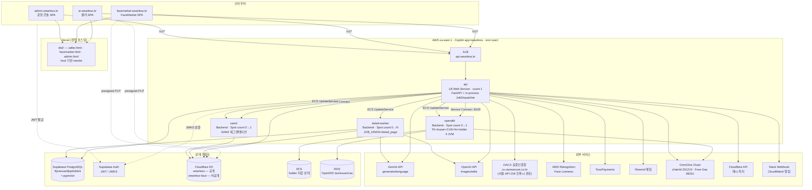

**핵심 성질**

| 성질 | 내용 |
|---|---|
| 단일 레포·다중 산출물 | 프론트 3앱 + FastAPI + SAM2 서비스 + OpenDID 스택이 한 레포 |
| 상태 없는 컴퓨트 | ECS 태스크는 전부 stateless. 상태 = Supabase PG + R2 (+ holder만 EFS) |
| 잡 큐 = DB | 별도 브로커 없음. `jobs` 테이블 `FOR UPDATE SKIP LOCKED` 폴링 |
| 플래그 지배 | 기능 대부분이 env 플래그 뒤. off면 라우터 자체가 미등록(코드 미노출) |
| scale-to-zero | detail-worker · sam2 · opendid 는 평소 0대, api 가 수요 보고 깨움 |

---

## 2. 프론트엔드 — 3앱 1번들 트리

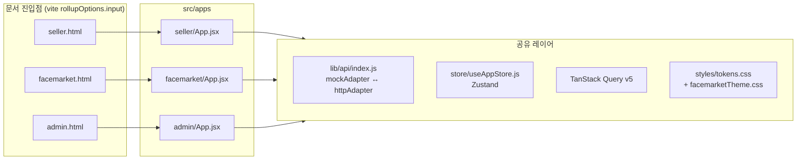

### 2.1 라우트 맵

| 앱 | 호스트 | 라우트 |
|---|---|---|
| seller | `ai.wearless.kr` | `library` `pricing` `credits/history` `payments/success·fail` `create/{input,mannequin,storyboard,generating}` `editor/:id` `verify/:licenseId` `verify/p/:publicationId` |
| facemarket | `facemarket.wearless.kr` | `models` `status` `payout` `register` `model-info` `license` `licensing` `pricing` `credits/history` `payments/*` `verify/*` |
| admin | `admin.wearless.kr` | `applications` `models` `staff` |

**배급 함정 (코드 주석에 못 박힌 것)**
- `dist/index.html` 이 존재하면 Vercel이 rewrite보다 파일시스템을 먼저 보고 host rewrite가 통째로 죽는다 → 셀러 문서 이름은 반드시 `seller.html`.
- `vite.config.js` 의 `input` 과 `vercel.json` 의 host rewrite는 **한 쌍**. 하나만 바꾸면 404 또는 미노출.
- dev 서버는 `facemarketDevDocument` 미들웨어가 `?facemarket=1` / `?admin=1` / host로 문서를 고른다. `/v1` 은 반드시 통과시켜야 API 프록시가 산다.

### 2.2 제작 마법사 흐름 (`src/lib/wizardSteps.js`)

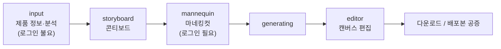

- `input`·`analysis` 는 STEP 0으로 합쳐지고, `generating` 은 `editor` 단계를 공유한다.
- 마네킹 생성이 오래 걸려서 **콘티보드가 마네킹보다 앞**에 온다 — 콘티 짜는 동안 생성이 백그라운드로 돈다.
- 게스트 구간(`PUBLIC_INPUT`)은 서버 projectId가 없어 로컬 draft(mock)에 쓰고, 분석만 `POST /v1/public/analyze` 로 진짜 AI를 태운다.

### 2.3 API 어댑터 경계 (`src/lib/api/index.js`)

```
VITE_API_MODE = mock   → 전부 mockAdapter
VITE_API_MODE = http   → httpAdapter
                         + CLIENT_ONLY 화이트리스트만 mock 유지
                         + 미구현 함수는 조용한 폴백 대신 즉시 throw
```
조용한 mock 폴백이 가짜 데이터를 실서버 요청에 흘려 404를 만들던 "poison" 재발 방지가 이 설계의 이유.

---

## 3. 백엔드 — 모듈 지도

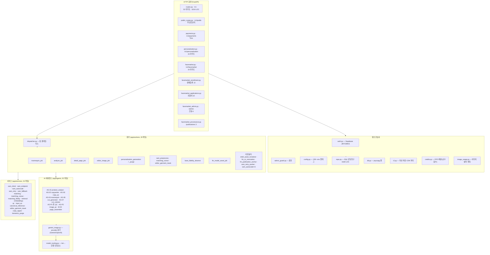

### 3.1 라우터 등록 게이트 (`app/main.py`)

| 라우터 | 게이트 |
|---|---|
| `v1_router`, `public_router`, `payments_router` | 항상 |
| `facemarket_router` | `FACEMARKET_ENABLED` |
| `applications_router`, `admin_console_router` | `FACEMARKET_ENABLED` |
| `biometric_enrollment_router` | `FM_BIOMETRIC_ENROLLMENT_ENABLED` |
| `provenance_router` | `FM_PROVENANCE_ENABLED` |
| `personalization_router` | `PERSONALIZATION_ENABLED` |

off = 라우트 전체 일반 404. 생체정보 처리 코드가 프로덕션에 **배포조차 안 되게** 하는 설계.

기동 시 하드 검증(fail-fast):
- `production` + FaceMarket이면 `FACEMARKET_VC_REQUIRED=true` 필수.
- VC 필수면 Holder URL + HMAC secret 필수.
- FaceMarket/개인화 켜면 `R2_FACE_BUCKET`(비공개 버킷) 필수 — 얼굴 바이트가 공개 도메인 버킷에 떨어지는 것을 코드로 차단.

---

## 4. 잡 파이프라인 — 큐가 곧 DB

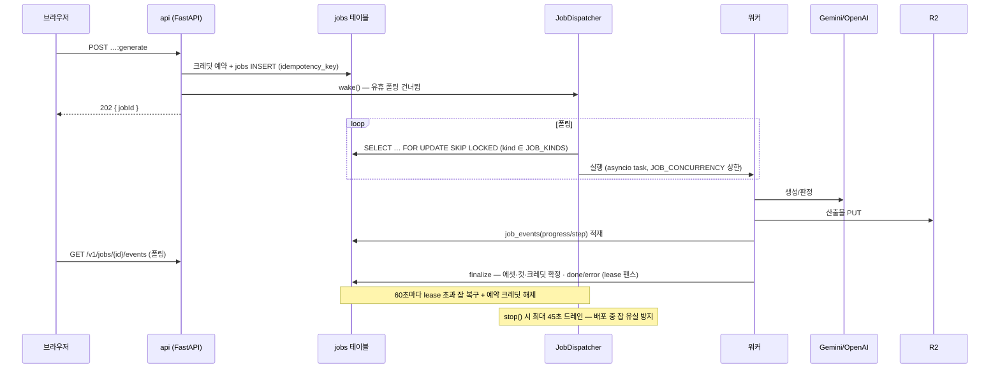

### 4.1 잡 종류 12개 (`workers/dispatcher.py::_WORKERS`)

| kind | 과금 | 하는 일 |
|---|---|---|
| `analyze` | 무과금 | AG-01 상품 분석 |
| `mannequin` | 과금 | AG-04 마네킹컷 생성 + QC 체인 |
| `detail_page` | 컷당 과금 | PL-4 상세페이지 (AG-06→02→03→M-02) |
| `editor_image` | 과금 | AG-06/07 에디터 이미지 (`new`/`vary`) |
| `mannequin_adjust` | — | @deprecated 툼스톤(legacy 드레인 전용, AI 미호출) |
| `personalization_generation` | — | 개인화 생성 경로 α |
| `personalization_purge` | — | 개인화 파기 캐스케이드 |
| `sam_preprocess` | 무과금 | 캐노니컬 컷아웃 전처리 |
| `matching_cutout` | 무과금 | 커스텀 매칭 의류 누끼 |
| `editor_garment_mask` | 무과금 | 톤 에디터용 착장 마스크 |
| `base_fidelity_observe` | 무과금 | 거부된 컷 관측(재생성과 병렬) |
| `fm_model_asset_build` | — | 실존 모델 자산 빌드(합성+QC) |

`JOB_KINDS` env가 프로세스별로 담당을 가른다:
- **api**: `-detail_page` (제외 목록) — 나머지 전부
- **detail-worker**: `detail_page` 전용, Spot 0대 상주

### 4.2 백그라운드 리컨실러 (api lifespan)

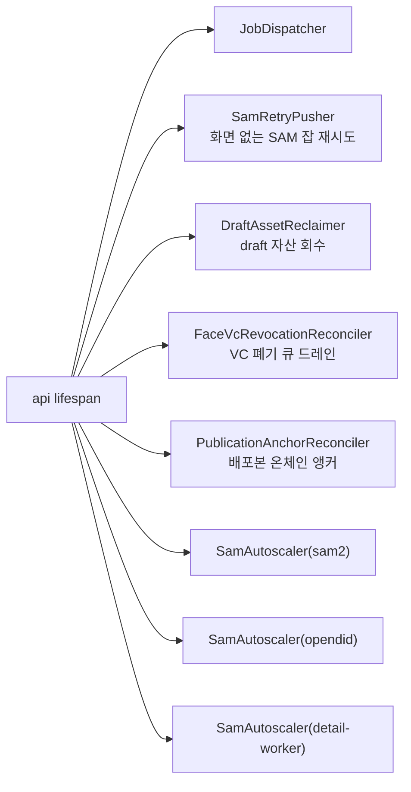

세 오토스케일러는 **같은 클래스 하나**를 `service` / `demand_fn` / `lock_key` 만 바꿔 재사용한다. detail-worker만 `capacity_attr`·`max_tasks_attr` 로 0↔N.

`SamRetryPusher`가 디스패처와 분리된 이유: 디스패처는 워커를 await 하므로 긴 잡이 도는 동안 타이머가 멈춘다.

---

## 5. AI 파이프라인 — 에이전트 카탈로그

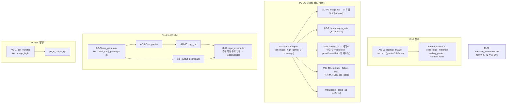

### 5.1 모델 라우팅 (`agents/model_routing.py` + env 단일소스)

| tier | 프로덕션 값 | 쓰는 곳 |
|---|---|---|
| `image_high` | `gemini-3-pro-image` | 마네킹 · 매칭 flat-lay · AG-07 |
| `detail_cut` | `gpt-image-2-2026-04-21` | AG-06 상세페이지 컷 |
| `image_signature` | image_high 상속 | 시그니처 컷(첫 화면) |
| `text` (gemini) | `gemini-3.1-pro-preview` | **게이팅 QC 전부** — 무뎌지면 다른 옷 컷이 출고됨 |
| `text` 분석 축 | `gemini-3.7-flash` | AG-01만 분리(비용 0.47배, 정확도 동률 실측) |

에이전트는 모델명을 직접 갖지 않는다. **tier만 선언** → 교체는 env 한 곳.

`gemini_image.py` 가 모델 id로 provider를 분기: `gpt-image*` → OpenAI `images/edits`(멀티 레퍼런스), 그 외 → Gemini. OpenAI 경로에는 429 백오프(`openai_retry_delay`)가 붙어 있다.

### 5.2 해상도·동시성 (프로덕션 실측 튜닝)

| 값 | 설정 | 근거 |
|---|---|---|
| 마네킹 기본 | `MANNEQUIN_IMAGE_SIZE=2K` | 1K는 작은 글자 깨짐(0/3), 2K는 3/4 통과, pro 요금 동일 |
| 미세 패턴 | `MANNEQUIN_PATTERN_IMAGE_SIZE=4K` | config 기본이 우선 |
| 상세페이지 컷 | `DETAIL_CUT_IMAGE_SIZE=2K` | 4K→2K, 2336×3504 → 1536×2304, 실비·메모리 동시 완화 |
| 동시 컷 | `DETAIL_CUT_CONCURRENCY=5` + `STAGGER_MS=1000` | 무제한 병렬이 2GB 태스크를 죽여 5장 유실(2026-08-18) |
| 재시도 | `DETAIL_CUT_MAX_ATTEMPTS=1` / `MANNEQUIN_MAX_ATTEMPTS=2` | first-result 계약 / 편집 패스와 예산 공유 |

### 5.3 QC 정책 상태 (프로덕션)

| QC | 모드 | 비고 |
|---|---|---|
| `IMAGE_QC` (AG-P2 의류 동일성) | **enforce** | 임계 실측 재캘리브 후 승격. 판정 실패는 fail-open |
| `MANNEQUIN_AXIS_QC` (AG-P1) | **enforce** | 미달 컷 출고 방지 > 오발화 비용 |
| `MANNEQUIN_BASE_FIDELITY_QC` | **enforce** | 게이팅 축은 `poseFrameMatch` 하나뿐, `wearGeometry`는 기록만 |
| `MANNEQUIN_PANTS_QC` | **enforce** | 하드게이트 4종(색·종류·통·구조), 기존 예산 안에서 재롤 |
| `MANNEQUIN_QC_ENABLED` | **false(shadow)** | `missing_lower_body` 오탐으로 pass율 0% → 재캘리브 대기 |
| `CUT_OUTPUT_QC_MODE` | `repair` | |
| `GARMENT_QC_MODE` | `off` | 신규 hard-gate가 커버, 구 best-of 중복비용 제거 |

> 모든 판정기는 **fail-open**: 판정이 죽어도 생성은 안 막는다.

---

## 6. 검색 증강 (RAG) · 세그멘테이션

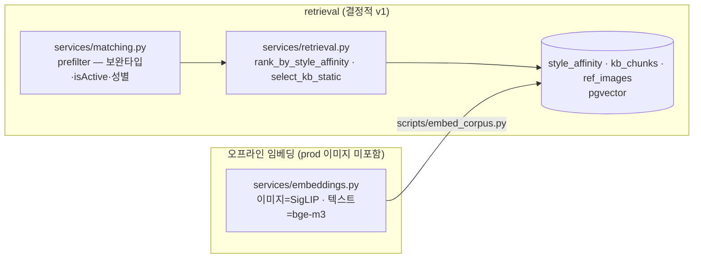

- 요청 경로에서 **임베딩 호출 금지**(NFR-5). 랭킹은 순수 함수, tie-break은 `id` 오름차순 고정.
- 프리필터는 `matching.py` 것을 재사용 — 재구현 금지(드리프트 방지).
- torch/transformers는 lazy import + optional group `[embeddings]`.

### 6.1 SAM2 서비스 (`server/sam_service`)

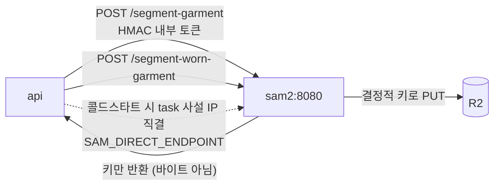

- **참조로 반환**: 서비스는 PNG를 결정적 R2 키에 쓰고 키만 돌려준다. 앱 DB는 절대 안 건드린다.
- 키 = 소스 콘텐츠 해시 + view + 모델버전 + 알고리즘버전 → 이미 있으면 ~25초 추론을 건너뛴다(재시도가 싸진다).
- 앞/뒤 뷰 독립 — 한쪽 실패가 다른 쪽을 버리지 않는다.
- SAM이 죽어도 업로드·분석·마네킹 생성은 전부 그대로 돈다(`sam_fallback`).
- 콜드스타트 209초 해부: SC 등록 대기가 87초 → `SAM_DIRECT_ENDPOINT=on` 이 DescribeTasks(+5초)로 얻은 task IP 로 직결.

---

## 7. 데이터 모델 — 67 테이블 도메인 그룹

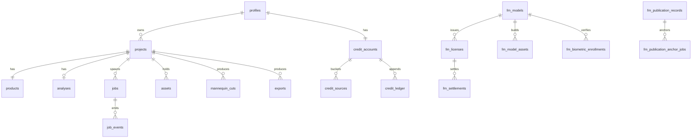

| 도메인 | 대표 테이블 |
|---|---|
| **코어 제작** | `profiles` `projects` `products` `analyses` `assets` `mannequin_cuts` `wardrobe_images` `matching_items` `exports` `export_assets` `export_provenance` `draft_slots` |
| **잡** | `jobs` `job_events` |
| **크레딧·결제** | `credit_accounts` `credit_sources` `credit_ledger` `pricing_plans` `payment_history` `refund_requests` `toss_payment_orders` |
| **품질·계보** | `generation_runs` `generation_outputs` `approved_baselines` `baseline_review_events` `edit_sessions` `edit_review_events` `qc_results` `product_truth_packages` `product_truth_assets` `product_truth_review_events` |
| **검색 증강** | `kb_chunks` `ref_images` `style_affinity` (pgvector) |
| **FaceMarket** | `fm_models` `fm_licenses` `fm_identity_verifications` `fm_model_assets` `fm_model_asset_cleanup` `fm_settlements` `fm_settlement_signer_intents` `fm_settlement_simulation_limits` `fm_cutover_batches` `fm_output_records` |
| **FaceMarket 지원서** | `fm_model_applications` `fm_model_application_emails` `fm_model_application_photo_staging` |
| **FaceMarket 생체** | `fm_biometric_enrollments` `fm_biometric_enrollment_photos` `fm_biometric_enrollment_photo_cleanup` `fm_biometric_purge_manifests` `fm_biometric_purge_receipts` |
| **FaceMarket 공증** | `fm_publication_records` `fm_publication_anchor_jobs` `fm_vc_revocation_jobs` |
| **개인화** | `personalization_profiles` `personalization_consents` `personalization_face_photos` `personalization_generations` `personalization_identity_verifications` `personalization_audit_log` |
| **관측·운영** | `image_usage_events` `admin_audit_log` `ai_output_cleanup_intents` |

### 7.1 상태 기계

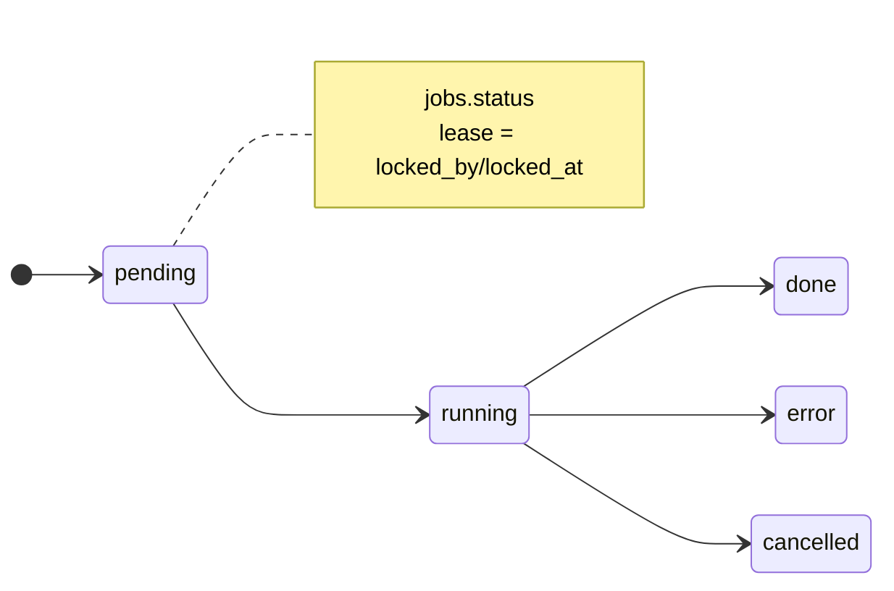

| 엔티티 | 상태 |
|---|---|
| `jobs` | `pending → running → done \| error \| cancelled` |
| `projects` | `draft → generating → done` |
| `fm_models` | `pending → verified \| suspended \| reverification_required` |
| `fm_licenses` | `pending → active → revoked \| expired \| reverification_required` |
| `fm_biometric_enrollments` | `photos_pending → liveness_pending → processing → asset_building → license_pending → vc_pending → passed \| failed \| cancelled \| expired` |
| `fm_model_applications` | `under_review → approved \| rejected \| cancelled` |
| `personalization_profiles` | `draft → ready → purging → purged` |
| `toss_payment_orders` | `pending → paid \| failed \| canceled` |

---

## 8. 크레딧 시스템

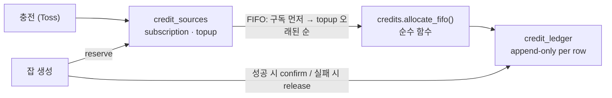

- 예약(`credits_reserved`) → 확정(`credits_charged`) 2단계. lease 복구가 error 처리한 잡은 예약 자동 해제.
- `detail_page` 는 **부분 성공 과금**: 성공 컷 수 × `CREDIT_COST_STORYBOARD_PER_CUT` 만 confirm. 실패 컷은 빈 슬롯 + 미차감, 전체 중단 없음.
- 단가는 `CREDIT_COST_*` env + `CREDIT_COST_VERSION` 으로 버저닝, 잡 `metadata` 에 스냅샷.

---

## 9. FaceMarket — 검증 실명 모델 마켓

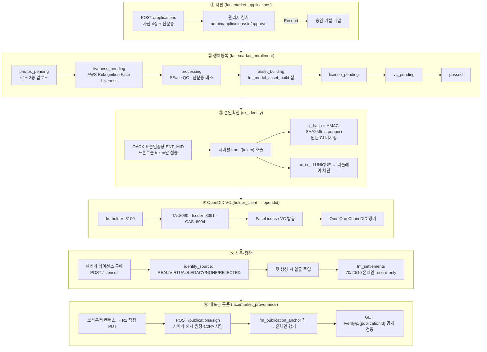

### 9.1 PII 하드 룰 (코드로 강제)

- 얼굴 바이트는 **비공개 버킷 `wearless-face`** 전용. 공개 도메인 연결 버킷 폴백 금지 → 없으면 기동 실패.
- 원문 CI 미저장. `ci_hash` 단일 보관. 생년은 **연도만**, 이름은 마스킹.
- 얼굴 원본·임베딩·digest·r2_key는 응답/로그/에러/job payload **전부 미노출**. 화이트리스트만.
- `cross_border_transfer` 동의 없이는 얼굴 바이트가 어떤 외부 API(Gemini=미국)로도 안 나간다 — 업로드 라우트가 QC 호출 **전에** 코드로 게이트.
- 결과는 인증 게이트 라우트(`/generations/{id}/results/{n}/file`)로만 서빙.

### 9.2 identity_source — 컷당 단일 소스

| 값 | 의미 |
|---|---|
| `REAL` | 실존 모델 자산(그리드+face_front, 비공개 버킷) — 라이선스 활성일 때만 |
| `VIRTUAL` | 가상모델(`virtual_models.json`, 공개 버킷) — 라이선스 불요 |
| `LEGACY` | 모델 미선택 기존 단일 얼굴 호환 |
| `NONE` | 얼굴 없이 생성 |
| `REJECTED` | 실존 모델 대상인데 라이선스 실패 → **조용한 폴백 금지**, 얼굴 미주입 |

`assets_source_hash` 무결성 비교로 stale 자산은 fail-closed.

### 9.3 온체인 정산 (`facemarket_chain.py` + `contracts/`)

- **record-only** — 코인 이동 없음. `recordSettlement(paymentId, modelRef, total)` 로 70/20/10 분배를 불변 기록, `getSettlement` eth_call 로 확인.
- Free-Gas BESU 제약: EIP-1559 거부 → **legacy tx (type 0), gasPrice 0**.
- 단일 owner 키가 유일 recorder → nonce 충돌 방지 **직렬화 Lock**.
- 네 값(rpc·address·private_key·chain_id) 다 있어야 활성. 하나라도 없으면 정산 훅이 no-op.
- 컨트랙트: `contracts/FaceMarketSettlement.sol` · `contracts/FaceMarketProvenance.sol`

### 9.4 OpenDID 단일 컨테이너

```
opendid (Fargate Spot, count 0→1)
└─ entrypoint.sh — localhost 로 4 JVM 기동 (각 -Xmx384m)
   ├─ TA        :8090
   ├─ Issuer    :8091
   ├─ CAS       :8094
   └─ fm-holder :8100  ← api 가 여기로 VC 요청 (HMAC 서명)
상태는 컨테이너 밖: RDS(tas/issuer/cas DB) + EFS(holder 지갑) + SSM(base64 wallet secrets)
체인은 외부 OmniOne Chain RPC (컨테이너 안에 besu 없음)
```

> ⚠️ 신뢰경계 주의(코드 주석): 커스터디얼 홀더가 `did:omn:wallet` + `did:omn:cas` 개인키를 직접 보유·서명한다. 자체호스팅 단일운영 데모라 성립하는 구조이며, 실서비스에서는 WALLET_PROVIDER/CAS를 별도 신뢰 도메인으로 분리해야 한다.

---

## 10. 개인화 (Personalization) — 본인 얼굴·신체

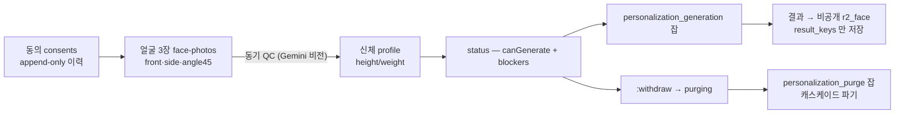

- 잡 payload는 `{profileId, productImageAssetIds, options, generationId}` — **얼굴 바이트·게이트 URL 금지**. 워커가 `profileId` 로 서버측 로드.
- 얼굴 슬롯 주입 순서 고정 `front→side→angle45` (모델 입력 안정화).
- 진행 중 프로필이 `purging|purged` 가 되면 결과 폐기 + job error.
- 결과는 공유 `assets` 테이블에 **미적재** — `personalization_generations.result_keys` 전용.
- purging 중 모든 쓰기는 `409 purge_in_progress`.

---

## 11. 자산 저장 — R2 키 규칙

```
users/{userId}/projects/{projectId}/uploads/{assetId}.{ext}   업로드 원본
users/{userId}/projects/{projectId}/ai/{jobId}/{assetId}.{ext} AI 산출물
users/{userId}/projects/{projectId}/derived/{assetId}.{ext}    파생
faces/{modelId}/{licenseId}.{ext}                              라이선스 얼굴 (비공개 버킷)
enrollment/{...} quarantine · original                          생체등록 (비공개 버킷)
model-assets/{modelId}/{enrollmentId}/{view}.{ext}              실존 모델 자산 (비공개 버킷)
```

| 항목 | 규칙 |
|---|---|
| 업로드 | 백엔드가 presigned PUT 발급 → **브라우저가 R2로 직접 PUT** → `complete` 에서 HEAD 검증. 서버가 바이트 프록시 안 함 |
| 서빙 | `R2_PUBLIC_BASE=images.wearless.kr` 커스텀 도메인. 비공개는 short-lived signed GET |
| 캐시 | 불변 자산 `public, max-age=31536000, immutable` / 민감 `private, no-store` |
| 퍼지 | Cloudflare API로 prefix 퍼지 — 배치 30개 · 12초 간격 · 지수 백오프 |
| MIME | 화이트리스트(png/jpg/webp/gif/avif)만 |
| 블로킹 | boto3는 동기 → 라우트에서 `asyncio.to_thread` 로 감쌈(이벤트 루프 동결 방지) |

> 2026-08-26 ALB 장애의 근본원인이 **동기 이미지 작업의 이벤트 루프 동결**이었다. `to_thread` 격리가 그 대책.

---

## 12. 배포 · CI/CD

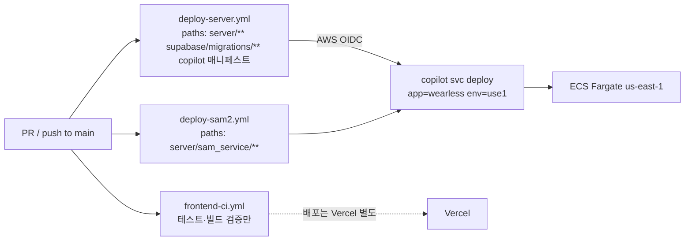

| 항목 | 값 |
|---|---|
| Copilot 앱 메타데이터 리전 | `ap-northeast-2` (앱은 못 옮김 — 여길 us-east-1로 바꾸면 CI 통째로 죽음) |
| 실제 배포 리전 | `us-east-1` (환경 `use1` 정의가 결정) |
| ECR | `439328746001.dkr.ecr.us-east-1.amazonaws.com/wearless/{api,opendid}` |
| 이미지 캐시 | `:buildcache` 태그 + `BUILDKIT_INLINE_CACHE=1` |
| 롤링 | `deployment.rolling: default` (maxPercent 200) — `recreate` 는 AZ Rebalancing과 비호환 |
| 헬스체크 | `/healthz` 10s×2 판정 + 10s 드레인 (기본값 150s+60s에서 단축) |
| opendid | **매뉴얼 배포** (CI 미포함, 이미지 유일본) |
| addons | `copilot/api/addons/sam-autoscale.yml` · `copilot/environments/addons/log-slack-alerts.yml` |

> 로컬 `copilot deploy` 금지 — 과거에 `.env` 평문과 4.7GB `ab_out` 을 프로덕션 이미지에 실은 사고(2026-08-26).

---

## 13. 관측 · 알림

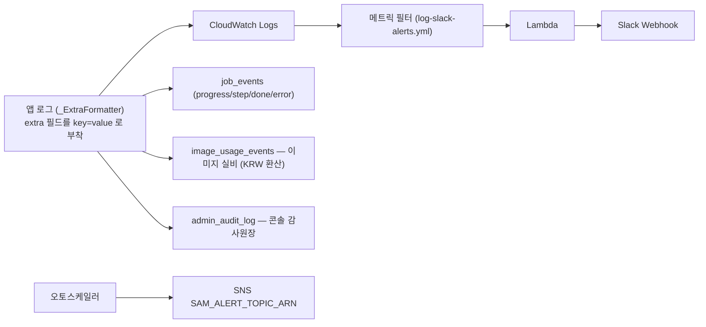

- 중앙 로깅 설정이 없어 `wearless.*` / `app.*` INFO 로그가 prod에서 묻히던 문제를 `_configure_logging()` 이 해결. `LOG_LEVEL` env로 조절.
- 서드파티 소음(httpx, botocore, boto3, urllib3, asyncio)은 WARNING으로 억제.
- 인라인 Lambda는 4096바이트 한도 주의.

---

## 14. 기능 플래그 지도 (프로덕션 현재값)

| 그룹 | 플래그 | 값 |
|---|---|---|
| **도메인 게이트** | `FACEMARKET_ENABLED` | `true` |
| | `FACEMARKET_VC_REQUIRED` | `true` |
| | `PERSONALIZATION_ENABLED` | `true` |
| | `FM_BIOMETRIC_ENROLLMENT_ENABLED` | `true` |
| | `FM_PROVENANCE_ENABLED` | `true` |
| **QC** | `IMAGE_QC` / `MANNEQUIN_AXIS_QC` / `MANNEQUIN_BASE_FIDELITY_QC` / `MANNEQUIN_PANTS_QC` | `enforce` |
| | `MANNEQUIN_QC_ENABLED` | `false` (shadow) |
| | `GARMENT_QC_MODE` | `off` |
| | `CUT_OUTPUT_QC_MODE` | `repair` |
| **편집 패스** | `MANNEQUIN_UNTUCK_PASS` / `_GATE` | `on` |
| | `MANNEQUIN_FABRIC_PASS` | `on` |
| | `MANNEQUIN_BUST_PASS` / `_GATE` | `on` |
| | `MANNEQUIN_TONE_EDITOR` | `on` |
| **매칭** | `MATCHING_CUTOUT` | `on` |
| | `MATCHING_FLATLAY` | `full` |
| | `MATCHING_FLATLAY_TIER` | `image_high` |
| **오토스케일** | `SAM_AUTOSCALE` / `OPENDID_AUTOSCALE` | `on` · 유휴 30분 |
| | `DETAIL_WORKER_AUTOSCALE` | `on` · 유휴 10분 |
| | `SAM_DIRECT_ENDPOINT` | `on` |
| **기타** | `GENEXAMPLE_BG_ENABLED` | `true` (프론트 `VITE_GENEXAMPLE_BG_ENABLED` 와 짝) |
| | `JOB_CONCURRENCY` / `DB_POOL_MAX_SIZE` | `1` / `10` |

`config.py` 에 정의된 설정 필드는 **130개 이상**. 전체 목록은 `server/app/config.py` 가 정본.

---

## 15. 되풀이 금지 함정 (코드 주석에 박힌 실측)

| # | 함정 | 방어 |
|---|---|---|
| 1 | `dist/index.html` 이 있으면 Vercel host rewrite가 죽음 | 셀러 문서 = `seller.html` |
| 2 | dev 미들웨어가 `/v1` 을 삼켜 API 프록시 사망 | 경로 예외 처리 |
| 3 | 새 앱 진입점을 `optimizeDeps.entries` 에 안 넣으면 504 흰 화면 | 문서 추가 시 목록 동시 갱신 |
| 4 | amplify 전체 include 시 `index.browser` basename 충돌 → 404 | `@smithy/core`·`@aws-sdk/core` exclude |
| 5 | 배포 중 잡 통째 사망 → 컷 8장 $1.24 유실 | dispatcher `stop()` 45초 드레인 |
| 6 | 4K 무제한 병렬이 태스크 OOM → 5장 유실 | `DETAIL_CUT_CONCURRENCY=5` + stagger |
| 7 | 동기 이미지 작업이 이벤트 루프 동결 → ALB 장애 | `asyncio.to_thread` 격리 |
| 8 | 롤링 배포의 구·신 태스크가 Supabase pooler(15) 잠식 → PGRST002 | `DB_POOL_MAX_SIZE=10` |
| 9 | `recreate` 배포가 AZ Rebalancing과 비호환 | `rolling: default` |
| 10 | Copilot 앱 메타데이터 리전을 바꾸면 CI 사망 | `AWS_REGION=ap-northeast-2` 고정 |
| 11 | 로컬 copilot 배포가 `.env`·`ab_out` 을 이미지에 실음 | 배포는 CI로만 |
| 12 | OACX가 한국 IP 전용 → us-east-1에서 차단 | 서울 API GW→Lambda 프록시 `CX_TRANS_BASE_URL` |
| 13 | 조용한 mock 폴백이 실서버 요청에 가짜 데이터 주입 | `buildHttpApi` 즉시 throw |
| 14 | holder 지갑 tmpfs 소멸 → 체인 앵커 불일치 | EFS 영구화 |
| 15 | `text` tier를 flash로 내리면 게이팅 QC가 무뎌짐 | 분석 축(`_ANALYSIS`)만 분리 |

---

## 16. 문서 지도

| 위치 | 내용 |
|---|---|
| `documents/PRD.md` | 제품 요구사항 17개 섹션 |
| `documents/common_data_contract.md` | 백↔프론트 스키마·API 명세 |
| `documents/ai_agent_modules.md` | AG-01~08 · M-01/02 · AG-P1/P2 카탈로그 |
| `documents/ai_pipeline_spec.md` | PL-1~PL-6 · job 모델 · 크레딧 매핑 |
| `documents/credit_system_design.md` | FIFO 배분·불변식 |
| `documents/FACEMARKET_PRD.md` | FaceMarket 기획 |
| `documents/frontend_state_model.md` | 3계층 상태 설계 |
| `CONTEXT.md` | 도메인 용어집(컷 종류·블록 종류) |
| `docs/adr/` | 11개 ADR |
| `docs/runbooks/` | 운영 런북 |
| `docs/personalization/` | 개인화 api-spec 등 8개 |
| `deploy/opendid/README.md` | OpenDID 프로비저닝·복구 |
| `contracts/README.md` | 온체인 컨트랙트 |
