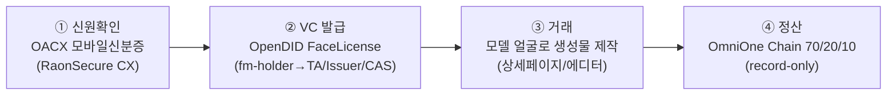
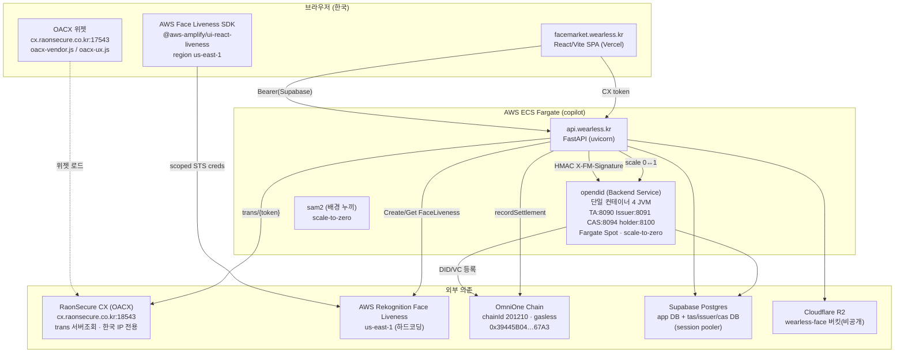
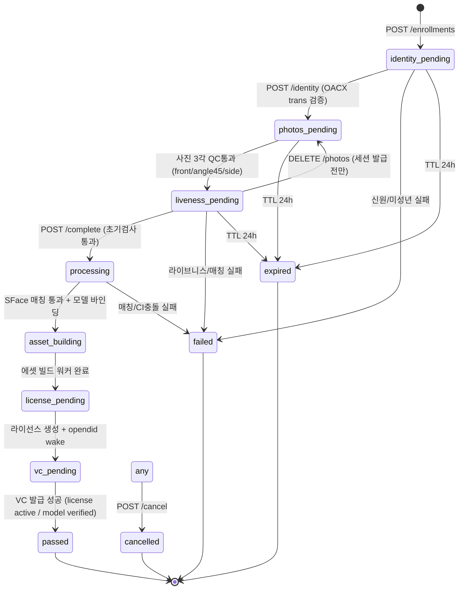
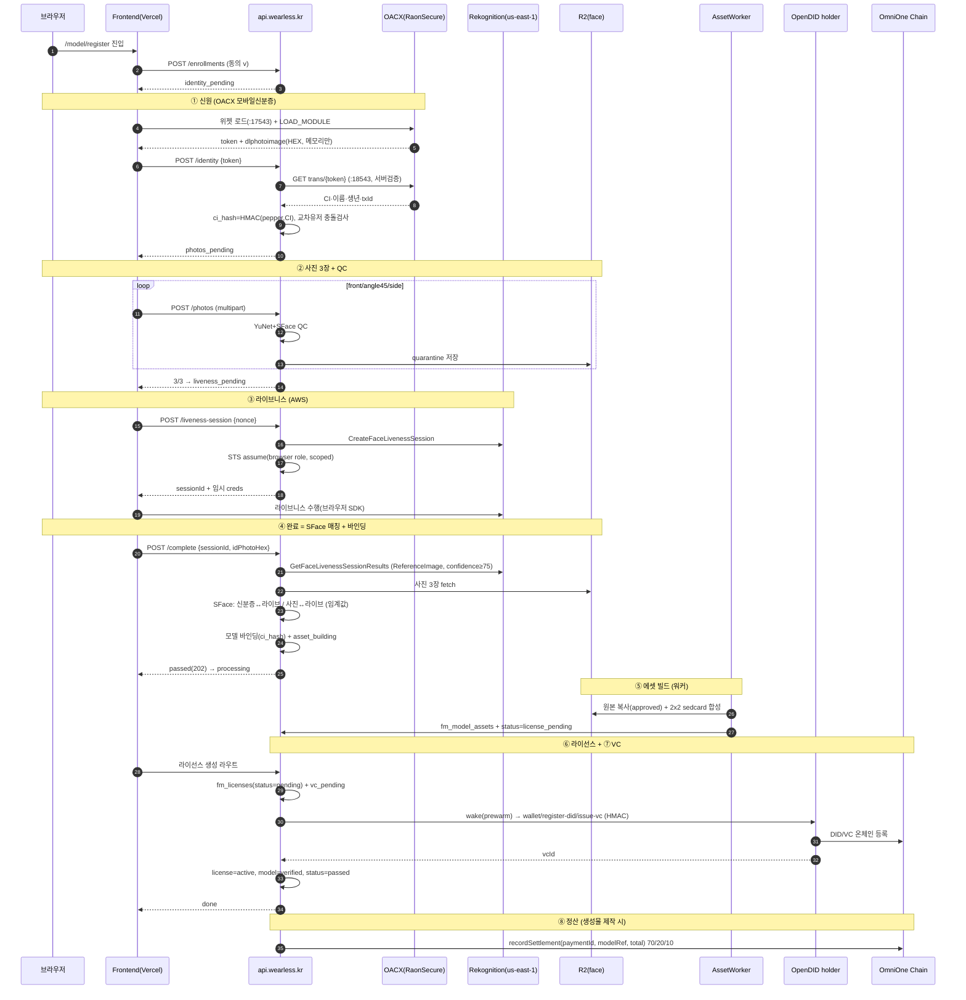
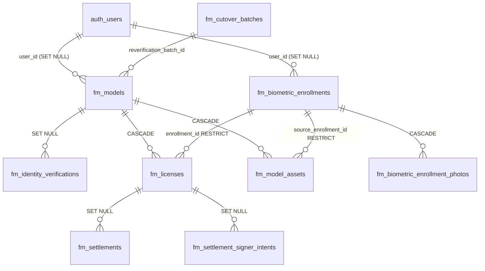
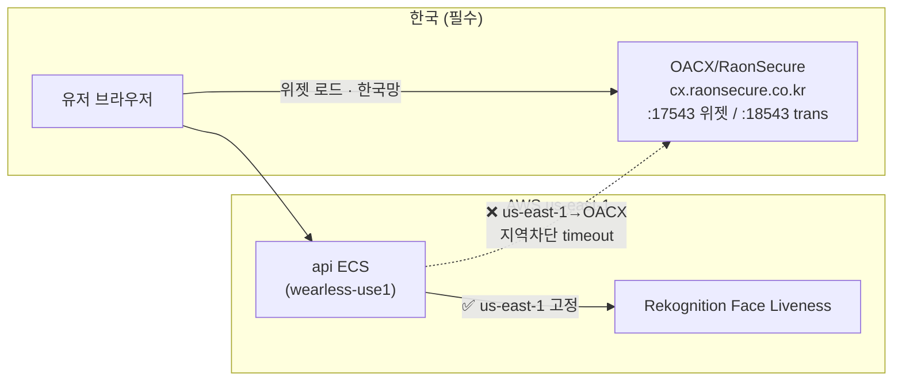

# FaceMarket 전체 동작 분석 (전수조사)

> 작성 2026-08-27. 대상 = `feat/editor-template-frames` 워크트리(`.worktrees/prod-deploy`).
> 방식 = 백엔드/프론트/DB/인프라 5개 도메인 병렬 코드 조사 후 종합. 모든 주장에 `file:line` 앵커.
>
> ⚠️ **리전 주의**: 레포 코드(`copilot/`)는 **ap-northeast-2(prod)** 기준. 하지만 **실제 배포된 인프라는 us-east-1(copilot env `wearless-use1`)** — 다른 브랜치/상태에서 커밋아웃됨. 아래 "현재 상태" 섹션 참고.

---

## 0. TL;DR

FaceMarket = **실존인물(모델)이 본인 얼굴을 검증 등록 → 그 얼굴로 상세페이지/에디터 생성물에 쓰이고, 매출을 온체인 정산**하는 파이프라인. 하나의 등록 세션이 통과하려면 **신원(OACX 모바일신분증) → 사진3장+QC → 라이브니스(AWS) → SFace 얼굴일치 → 모델에셋 빌드 → 라이선스 발급 → OpenDID VC 발급** 을 순서대로 다 지나야 한다. 정산은 생성물(상세페이지/에디터 이미지)이 나올 때 OmniOne Chain에 70/20/10 기록.

**4-스텝 인증 표준** (해커톤 CX 요건):

---

## 1. 서비스/인프라 아키텍처

핵심:
- **프론트 = Vercel**(facemarket.wearless.kr, 등록 전용 라우팅 `IS_FACEMARKET`). ai.wearless.kr = 메인 앱.
- **api = ECS Fargate**, 얼굴 SFace 매칭·QC를 api 프로세스 안에서 직접(OpenCV, CPU).
- **opendid = 단일 컨테이너에 4 JVM**, besu 없음(체인은 외부 OmniOne). 평소 desired=0, VC 수요 생기면 autoscaler가 깨움(콜드 ~2분).
- 외부 의존 3개: **OACX(한국 전용)**, **Rekognition(us-east-1)**, **OmniOne Chain**.

---

## 2. 등록 상태머신

**신원-먼저 재배치**(2026-08-24). 새 등록은 `identity_pending`으로 시작(`fm_biometric_enrollments.status` DB DEFAULT).

- **터미널**: `passed`, `failed`, `cancelled`, `expired`. `failed/cancelled/expired`는 격리사진 정리(`cleanup_terminal_enrollment`, `facemarket_enrollment.py:1406`).
- **TTL** 24h(`ENROLLMENT_TTL`, `:34`). **쿨다운**: 3분내 비재시도 실패 5회 → 45분(`:1668`).
- `asset_building → license_pending → vc_pending → passed`는 라우터가 아니라 **워커/라이선스 라우트**가 구동. 프론트는 `license_pending`/`vc_pending`을 `terms` 스텝으로 표시.
- **재시도 가능 사유**(retryable): `liveness_retry`, `liveness_unavailable`, `qc_unavailable`, `id_portrait_unavailable`.
- **터미널 사유**(비재시도): `minor_blocked`, `liveness_failed`, `face_match_failed`, `identity_replay`, `identity_recovery_required`.

---

## 3. 등록 E2E 시퀀스

---

## 4. 단계별 상세

### ① 신원 — OACX 모바일신분증 (`facemarket_enrollment.py:744`, `cx_identity.py`)
- 위젯은 **클라이언트**가 `cx.raonsecure.co.kr:17543`에서 로드(`oacx-vendor.js`/`oacx-ux.js`) → `LOAD_MODULE`. 콜백서 `token` + `data.dlphotoimage`(신분증 초상 HEX) 받음. **초상은 메모리(`portraitRef`)만, 저장/로그 금지**.
- 서버는 `token`으로 `GET {cx_trans_base_url}/oacx/api/v1.0/trans/{token}` (**포트 18543**, `cx_identity.py:225`) 호출 → CI·이름·생년 수신(서버검증). token URL 인코딩으로 경로이탈/쿼리주입 방어.
- `ci_hash = HMAC-SHA256(FM_CI_PEPPER, CI)` (`:765`), 원시 CI 즉시 wipe. 미성년(만 19세 미만, KST) → `minor_blocked`.
- **교차유저 CI 충돌**(`identity_recovery_required`): `fm_models where ci_hash=%s` 소유자가 타유저면 차단. 신원단계(`:805`)+완료단계(`:1909`) 2곳.
- 계약 = `prod-dlphoto-v1`(실 프로덕션, `cx_identity.py:88`). `identity_pending → photos_pending`.

### ② 사진 3장 + QC (`facemarket_enrollment.py:856`, `agents/face_qc.py`)
- 각도 `front/angle45/side` 정확히 3장. MIME png/jpeg/webp, ≤25MB.
- QC = **OpenCV SFace 임베딩 + YuNet 검출**(insightface 아님, CPU 제약). 얼굴 1개 아니면 `no_face_detected`/`multiple_faces`.
- 통과분은 R2 **quarantine** 저장(`qc_status=passed`, `storage_state=quarantine`). 3/3이면 `liveness_pending`.

### ③ 라이브니스 — AWS Face Liveness (`:1137`, `:107`, `:140`)
- `CreateFaceLivenessSession`(백엔드) + `assume_role`로 **브라우저용 스코프 임시 크레덴셜**(StartFaceLivenessSession만, 15분) 발급 → 브라우저 SDK가 라이브니스 수행.
- **region us-east-1 하드코딩**(정책조건 `:48`, 응답 `:1275`, provider 문자열 `:1260`, 클라 `:2178-2180`, 기동가드 `:2132`). = api가 어느 리전이든 라이브니스는 us-east-1.
- 결과의 **ReferenceImage = 라이브 얼굴 앵커**. confidence ≥ `FM_LIVENESS_CONFIDENCE_THRESHOLD`(75) 아니면 `liveness_failed`, SUCCEEDED 아니면 `liveness_retry`.

### ④ 완료 — SFace 매칭 + 모델 바인딩 (`:2041`, `process_enrollment_completion:1788`)
- `liveness_pending → processing`(초기검사: 세션digest 일치, identity_tx 존재, 3장 QC).
- **SFace 1:1 매칭**(`:1844`):
  1. 신분증 초상 ↔ 라이브 ReferenceImage ≥ `FM_ID_LIVE_THRESHOLD`(0.363) — 실패시 차단.
  2. 업로드 사진 각각 ↔ 라이브 ≥ `FM_RETOUCHED_LIVE_THRESHOLD`(0.363). 측면 등 얼굴 미검출은 skip, **최소 1장** 통과해야(`matched_any`) 아니면 `face_match_failed`.
- 2차 CI충돌 검사(`:1909`) 후 `fm_models` insert/update(ci_hash), `fm_identity_verifications` insert(replay=`identity_replay`), `status=asset_building`, `fm_model_asset_build` 잡 enqueue.

### ⑤ 에셋 빌드 워커 (`workers/fm_model_asset_job.py:126`)
- quarantine 사진 3장 → 원본 복사(`storage_state=approved`), **2×2 sedcard 합성**(`face_grid.py`, 생성형 아님) + `face_front`.
- `fm_model_assets`(view=`grid_sedcard`/`face_front`, bucket=`face`) upsert. `fm_models.assets_status=ready`, enrollment `status=license_pending`.

### ⑥ 라이선스 발급 (`facemarket.py:955`)
- `fm_licenses`(status=`pending`, allowed/forbidden_use, unit_price 기본 10000, valid_until, 게이트 face_image_uri) insert(멱등). `vc_pending` 전이 + `_wake_opendid`.

### ⑦ VC 발급 — OpenDID FaceLicense (`facemarket.py:1765`, `holder_client.py`)
- fm-holder에 3연속 POST(HMAC `X-FM-Signature`, 각 180s): `wallet`(201/409) → `register-did`(200) → `issue-vc`(200, plan=facelicense, idempotencyKey=`fm-license:{id}`, claims=allowed/forbidden/unitPrice/validUntil/faceImageDigest).
- 성공: `fm_licenses.status=active + vc_id`, `fm_models.status=verified + did`, enrollment `passed`. 실패: `vc_issue_delayed`(503) + opendid 재wake.
- 미발급분 재시도 스크립트 `retry_pending_face_vcs.py`. 폐기 큐 리컨사일러 `fm_vc_revocation_reconciler.py`.

### ⑧ 정산 — OmniOne Chain (`facemarket_chain.py`, `contracts/FaceMarketSettlement.sol`)
- **생성물 성공 시** 훅(상세페이지 `detail_page_job.py:1674`, 에디터 `editor_image_job.py:807`) — `source=REAL` & unit_price 있고 체인 설정 완료시.
- 컨트랙트 `recordSettlement(paymentId, modelRef, total)` = **70/20/10**(모델/플랫폼/운영, bps). **코인 이동 없음**, off-chain paymentId 키의 불변 원장. gasPrice 0, chainId 201210. 게이트웨이가 receipt 미노출 → `getSettlement` eth_call 폴링.
- 단일 서명자 논스 펜스(`fm_settlement_signer_intents` + advisory lock), 크래시 리컨사일. DB 미러 = `fm_settlements`.
- 체인 설정 4개(`FM_CHAIN_RPC_URL`/`FM_SETTLEMENT_ADDRESS`/`FM_CHAIN_PRIVATE_KEY`/id) 다 있어야 활성, 없으면 `settlement_skipped_no_chain` no-op.

---

## 5. 데이터 모델 (`fm_*`)

주요 테이블:
- **`fm_models`** — 검증 모델 카탈로그. `ci_hash` UNIQUE(중복 신원 단일화), `status`(pending/verified/suspended/reverification_required), `did`, `assets_status`, `current_enrollment_id`.
- **`fm_biometric_enrollments`** — 등록 상태머신(§2). identity_ci_hash/name_masked/birth_year/tx_digest, liveness_session/nonce digest, cooldown_until, expires_at, decision/reason, provider_versions.
- **`fm_biometric_enrollment_photos`** — 격리 업로드(PK `(enrollment_id, angle)`, CASCADE).
- **`fm_licenses`** — 얼굴 라이선스/VC 포인터. model_id NOT NULL(CASCADE), enrollment_id RESTRICT, vc_id, status(pending/active/revoked...).
- **`fm_model_assets`** — 뷰별 R2 키(PK `(model_id, view)`, CASCADE).
- **`fm_identity_verifications`** — CX 감사/리플레이(cx_tx_id UNIQUE = SHA256 digest).
- **`fm_settlements` / `fm_settlement_signer_intents`** — 정산 미러 + 논스 펜스(재무이력은 항상 SET NULL, 캐스케이드 삭제 안 함).
- **`fm_vc_revocation_jobs`** — VC 폐기 durable 큐(**FK 없음**, 의도적 디커플).
- **정리 큐**(FK 없음): `fm_biometric_enrollment_photo_cleanup`, `fm_model_asset_cleanup` — DB 삭제와 R2 GC 분리.

**설계 패턴**: 라이선스/에셋은 등록을 RESTRICT로 보호·모델서 CASCADE, 정산/감사 미러는 SET NULL로 재무이력 보존.

---

## 6. 워커 (`main.py` lifespan)

| 워커 | 역할 | 트리거 |
|---|---|---|
| SamAutoscaler(sam2) | 배경누끼 서비스 0↔1 | 60s 루프, 업로드시 prewarm |
| SamAutoscaler(opendid) | holder 컨테이너 0↔1 | 수요=`license_pending`/`vc_pending`, 30분 유휴→0 |
| FaceVcRevocationReconciler | VC 폐기 큐 구동 | 3s sweep(holder 설정 or vc_required시) |
| personalization_purge_job | 탈퇴/삭제 PII 파기 캐스케이드 | JobDispatcher 클레임 |
| fm_model_asset_job | 실모델 에셋 빌드(sedcard+QC) | dispatch, modelId singleflight |

---

## 7. 설정/Env 레퍼런스 (핵심)

| Env | 기본 | 의미 |
|---|---|---|
| `FACEMARKET_ENABLED` | false | 마스터 플래그 |
| `FM_BIOMETRIC_ENROLLMENT_ENABLED` | false | 생체등록 |
| `FM_OACX_CONTRACT_MODE` | disabled | OACX 계약(prod-dlphoto-v1) |
| `CX_TRANS_BASE_URL` | `https://cx.raonsecure.co.kr:18543` | OACX trans 서버조회 |
| `FM_LIVENESS_REGION` | us-east-1 | Rekognition 라이브니스 리전 |
| `FM_LIVENESS_CONFIDENCE_THRESHOLD` | (없음) | 라이브니스 신뢰도(prod 75) |
| `FM_ID_LIVE_THRESHOLD` / `FM_RETOUCHED_LIVE_THRESHOLD` | (없음) | SFace 코사인 게이트(prod 0.363) |
| `FM_CI_PEPPER` | (없음) | CI HMAC pepper (없으면 500) |
| `FACEMARKET_VC_REQUIRED` | false | VC 필수(prod 기동 fail-fast) |
| `OPENDID_HOLDER_URL` | (없음) | holder :8100 |
| `OPENDID_HOLDER_HMAC_SECRET` | (없음) | X-FM-Signature 공유키 |
| `OPENDID_AUTOSCALE` | off | holder scale-to-zero |
| `R2_FACE_BUCKET` | (없음) | 비공개 얼굴 버킷(wearless-face) |
| `FM_CHAIN_ID` / `FM_SETTLEMENT_ADDRESS` | (없음) | 201210 / 0x39445B04…67A3 |
| `FM_CHAIN_RPC_URL` / `FM_CHAIN_PRIVATE_KEY` | (없음) | OmniOne RPC / 서명키(시크릿) |

**prod 매니페스트**(`copilot/api/manifest.yml`): CORS에 facemarket 포함, 위 플래그 on, 임계값 prod값, 시크릿은 SSM SecureString. **기동가드**(`main.py:85-102`, `validate_biometric_settings:2125`) = prod+facemarket이면 VC필수·holder·region us-east-1·browser role·QC·pepper·SFace 가중치·임계값·계약모드 전부 있어야 부팅.

---

## 8. 인프라/리전 토폴로지 + 핵심 제약

**리전 상충(이 서비스의 핵심 제약):**

| | OACX 신원확인 | Face Liveness |
|---|---|---|
| ap-northeast-2(한국) | ✅ | ✅ (rekognition us-east-1 크로스리전) |
| us-east-1(미국) | ❌ 지역차단 | ✅ |

- **OACX(RaonSecure)는 한국 IP 전용** — us-east-1 egress에서 `cx.raonsecure.co.kr` TCP timeout(컨테이너 내부 실측: OpenAI OK vs CX FAIL). → `/identity` **500**(`httpx.ConnectTimeout`, `cx_identity.py:225` 미handled).
- **Face Liveness는 코드에서 us-east-1 하드코딩** → api 리전 무관하게 동작.
- **결론: api를 us-east-1에 둘 이유가 OACX엔 없고 오히려 깸.** 한국 리전이면 둘 다 바로 됨.

---

## 9. 현재 상태 / 알려진 블로커 (2026-08-27)

| 항목 | 상태 |
|---|---|
| 프론트(facemarket.wearless.kr, Vercel) | ✅ 라이브(200), 등록 라우팅 |
| api 배포(us-east-1 wearless-use1) | ✅ 기동, healthz 200 |
| DB 스키마(fm_* 마이그레이션) | ✅ 적용됨 |
| 라이브니스 IAM | ✅ 고침 — use1 TaskRole에 `fm-face-liveness` 정책(rekognition+assume) 붙임. 이전 세션 503(AccessDenied) 해소. IaC = `copilot/api/addons/liveness-iam.yml`(미배포) |
| **OACX /identity 500** | ❌ us-east-1 IP 지역차단. RaonSecure에 해외IP 화이트리스트 요청 필요(고정 EIP 선확보). |
| **신분증창 로딩 안 됨** | ❌ `cx.raonsecure.co.kr` 호스트 전 포트가 한국서도 timeout(2026-08-27) = RaonSecure측 다운/차단 의심. |
| VC(OpenDID) 발급 | ⏸ 위 신원단계 통과 후에야 도달 — 미검증 |
| Chain 정산 | ⏸ 코드/컨트랙트/env 슬롯 존재, 시크릿 프로비저닝 + 생성물 제작시 발화 |

**외부 의존(RaonSecure) 블로커 2개 → 디스코드 `omnione_cx` 문의:**
1. `cx.raonsecure.co.kr` 지금 다운/점검인가?
2. us-east-1 해외 IP 화이트리스트 가능한가?(가능시 고정 EIP 전달)

**레포/배포 divergence**: 이 워크트리 `copilot/`은 아직 **ap-northeast-2 prod** 기준. 실제 배포는 **us-east-1 wearless-use1**(다른 브랜치). us-east-1 이전 최종 커밋 시 라이브니스 addon 등이 use1 config에 반영돼야 IaC로 남음.

---

## 10. 파일 레퍼런스

| 영역 | 파일 |
|---|---|
| 등록 라우터/상태머신/매칭/완료 | `server/app/facemarket_enrollment.py` |
| OACX 신원/초상 파싱 | `server/app/cx_identity.py` |
| SFace/YuNet QC | `server/app/agents/face_qc.py` |
| 에셋 빌드 워커 | `server/app/workers/fm_model_asset_job.py` |
| 라이선스/VC/정산 라우트 | `server/app/facemarket.py` |
| holder HMAC 클라 | `server/app/holder_client.py` |
| 체인 정산 | `server/app/facemarket_chain.py`, `contracts/FaceMarketSettlement.sol` |
| VC 폐기 리컨사일러 | `server/app/workers/fm_vc_revocation_reconciler.py` |
| 프론트 등록 위저드 | `src/features/model/ModelRegister.jsx`, `FaceLivenessStep.jsx` |
| 프론트 API/상태맵/호스트 | `src/lib/api/facemarket.js`, `src/features/model/biometricEnrollment.js`, `src/lib/host.js` |
| DB 스키마 | `supabase/migrations/2026070900*~2026082102*_facemarket_*.sql` |
| 설정 | `server/app/config.py` |
| 배포 | `copilot/api/manifest.yml`, `copilot/opendid/manifest.yml`, `deploy/opendid/container/entrypoint.sh` |
