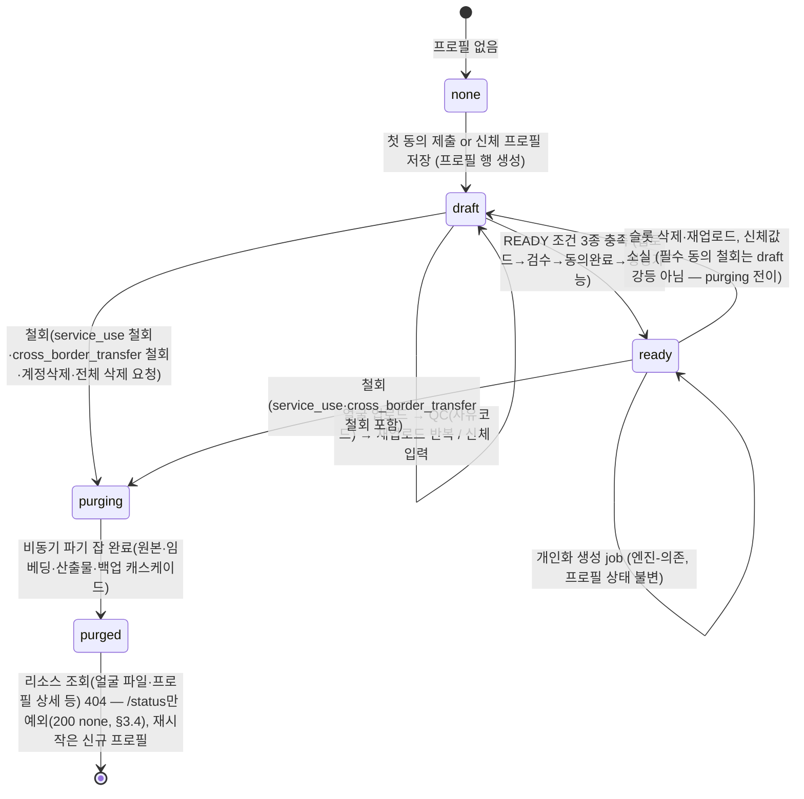

> 상태: PENDING APPROVAL — 실행 전 문서. 스코핑 계획(.omc/plans/user-face-personalization-scoping.md)의 하위 산출물.

# 개인화(사용자 얼굴·신체) 기능 API 명세

- 작성일: 2026-07-15
- 구현 시점: **Phase 2 (2026-09-21 해커톤 결선 이후)**. 이 문서는 계약(contract) 확정용이며, 실사용자 생체정보를 처리하는 어떤 코드도 결선 전에 배포하지 않는다.
- 컨벤션 근거: `server/app/routes.py`(라우터·에러·auth·job 패턴), `server/app/facemarket.py`(얼굴 PII 비공개 저장 + 게이트 스트림 선례).

---

## 0. 2단 분리 원칙

| 구분 | 범위 | 확정 수준 |
|---|---|---|
| **(1) 경로-독립** | 동의, 얼굴 업로드/품질검사, 신체 프로필, 삭제·철회, 상태 조회 | **지금 확정** — 생성 엔진과 무관하게 유효한 계약 |
| **(2) 엔진-의존** | 개인화 생성, 보정 요청 | **계약 수준만** — 입출력 골격만 고정. 상세 파라미터·비용·지연·전처리는 **TBD — 스파이크 T0-2(α 기존 Gemini 배관 / β 관리형 Qwen-Image-Edit / γ SDXL+ID어댑터) 후 확정** |

---

## 1. 공통 규약

### 1.1 라우터·등록

- 신규 파일 `server/app/personalization.py`, `APIRouter(prefix="/v1/personalization", tags=["Personalization"])` — FaceMarket과 동일한 도메인 분리 방식.
- **피처 플래그 `PERSONALIZATION_ENABLED`**: off면 `main.py`가 라우터를 아예 등록하지 않는다(`FACEMARKET_ENABLED` 선례 — 프로드 보호, Phase 2 전 배포 사고 방지). **off = 전 라우트 일반 404** — 따라서 `feature_disabled` 에러코드·blocker는 이 서버가 반환할 수 없으므로 계약에 두지 않는다(도달 불가 계약 금지).
- 프로필은 **사용자당 1개**(user 1:1). 경로에 profile id를 노출하지 않고 인증 주체(`user_id`)로 해석한다 — 타인 profile id 추측 공격 표면 자체를 제거.

### 1.2 인증·인가

- 모든 라우트: `user_id: str = Depends(require_user)` (JWT sub). Bearer 필수.
- 모든 리소스는 `user_id` 스코프 — **본인 것만** 조회/수정/삭제 가능. 타인 리소스는 403이 아니라 **404(존재 은닉)** 로 응답한다(FaceMarket 얼굴 게이트 선례).
- 얼굴 파일 게이트 라우트도 **Bearer 필수**. `routes.py`의 `/assets/{id}/file`(무인증 capability URL, 302 → 공개 R2) 패턴은 얼굴에 **금지** — `` 대신 프론트는 `fetch + objectURL`(FaceMarket `get_license_face` 방식).

### 1.3 에러 형식

raise는 기존 서버 스타일 그대로 `HTTPException(status_code, detail={"code": <snake_case>, "message": <한국어 안내>})` — 단, **와이어 바디는 `main.py`의 HTTPException 핸들러가 `{"error": {...}}` 봉투로 재포장한다**(`models.ErrorResponse = {error: ErrorDetail}`). 422 검증 오류도 `{"error": {"code": "validation_error", ...}}`로 나간다.

```json
{ "error": { "code": "consent_required", "message": "얼굴 업로드 전에 필수 동의가 필요해요." } }
```

| 상태 | 용도(이 도메인) |
|---|---|
| 400 | 도메인 검증 실패 — 코드로 구분(`face_quality`, `invalid_consent_type`, `invalid_body_profile`, `unsupported_type` 등) |
| 401 | 토큰 누락/만료/위변조 (공통) |
| 403 | 전제조건 미충족 — `consent_required`(필수 동의 미완), `minor_blocked`(미성년자 차단) |
| 404 | 리소스 없음 **+ 타인 소유 은닉 + 파기(purged)된 리소스** |
| 409 | 상태 충돌 — `purge_in_progress`(파기 진행 중 쓰기 시도), `already_processing` |
| 413 | 업로드 파일 크기 초과(`file_too_large`) — multipart 직접 수신 도메인은 FaceMarket `create_license` 선례(413)를 따른다 |
| 422 | FastAPI 자동(요청 본문 스키마 위반). 도메인 검증은 400을 쓴다(기존 `input_quality` 선례) |
| 402 | 크레딧 부족(엔진-의존 생성 라우트만, `insufficient_credits`) |

응답 스키마는 `ErrorResponse` 모델 재사용, 라우트 데코레이터의 `responses={...}`에 명시(`COMMON_RESPONSES` 패턴).

### 1.4 PII 취급 주석 (모든 구현 PR에 적용되는 하드 룰)

- **얼굴 원본·얼굴 임베딩(및 그 해시)은 생체정보** — 로그·메트릭·job payload·감사로그·에러 메시지에 **절대 미포함**. 로깅 허용 범위: 상태 enum, QC 사유코드, 집계 카운트뿐.
- **공개 URL 금지**: 얼굴 객체는 전용 비공개 버킷(`app.state.r2_face` 계열)에만 저장. `r2.public_url()` 호출 금지, presigned GET 발급도 금지(만료돼도 URL이 로그·히스토리에 남음). 바이트는 인증 게이트 라우트로만 스트림, `Cache-Control: no-store, private`.
- 응답 shape는 **화이트리스트 컬럼**만(내부 `r2_key` 비노출 — FaceMarket `LicenseCard` 선례).
- QC 과정에서 생성되는 중간 산출물(얼굴 검출 박스·랜드마크·임베딩)은 판정 직후 **메모리에서 즉시 파기**, 저장·로그 금지. DB에는 `qc_status`·`qc_reasons`만 남긴다.
- **국외이전**: 저장(R2)·생성 처리(Google/Replicate 등 = 미국) 위치가 해외 → `cross_border_transfer` 동의 없이는 얼굴 바이트가 어떤 외부 API로도 나가지 않는다(코드 게이트).
- **미성년자 차단**: 동의 제출·업로드·생성 3지점에서 연령 게이트. 미충족 시 403 `minor_blocked`.
  > ✅ **구현 완료(2026-07-15) — T2-1 결착**. 연령 소스 = **CX 표준인증창 본인확인**(`POST /v1/personalization/identity:verify`, §3.0). 후보였던 라이브니스는 '생존 확인'이라 연령 소스가 아니고, OpenDID 배선은 얼굴 라이선스 VC 전용이라 신원·연령 VC가 아니었다 — 검증된 생년월일을 실제로 주는 유일한 수단이 CX였다. `_assert_age_eligible`(단일 훅, `server/app/personalization.py`)이 4개 호출부(동의·업로드·생성·보정)에 배선됨. 미인증은 403 `identity_verification_required`, 미성년은 403 `minor_blocked`.
- 사칭 방지(업로드 얼굴 = 계정 본인 검증)는 **Phase 2 필수** — 본 명세의 업로드 계약에 검증 훅 지점만 예약(§3.2 비고), 수단(라이브니스/OpenDID 재사용)은 별도 결정.

---

## 2. 상태 전이

프로필 상태(`personalization_profiles.status`): `draft | ready | purging | purged`

파생 조건 **READY** = ① 3개 각도 슬롯 전부 `qc_status=passed` ∧ ② 필수 동의(`service_use`, `cross_border_transfer`) `granted` ∧ ③ 신체 필수값(`height_cm`, `weight_kg`) 입력 완료.



- `purging` 중에는 모든 쓰기 라우트가 409 `purge_in_progress`.
- `purged` 후 동일 사용자가 다시 시작하면 **새 프로필 행**을 만든다(파기 이력 불변 보존).

---

## 3. 경로-독립 API (지금 확정)

### 3.0 본인확인 / 연령 게이트 (T2-1 — 구현 완료)

개인화는 **성인 본인 동의** 전제(정책 게이트, [phase0-license-check.md](phase0-license-check.md))라 미성년은 차단한다(법정대리인 동의 플로우 없음 — PRD N2). 연령 소스는 **CX 표준인증창 본인확인** 하나뿐이다.

#### 진입점 = `/model/register` (FaceMarket 과 통합, Level 1)

**개인화 전용 본인확인 화면은 없다.** 사용자가 같은 CX 표준인증창을 두 번 겪지 않도록, 본인확인은 FaceMarket 실명 모델 등록 화면(`/model/register`)**하나로 통합**했다. 한 번의 CX 인증이 두 가지를 동시에 성립시킨다:

1. FaceMarket 실명 모델 등록·검증(`fm_models`)
2. 개인화 성인 확인(`personalization_identity_verifications.is_adult`)

> **목적별 고지(개인정보보호법)**: 하나의 본인확인을 두 목적에 쓰므로, 인증 화면 카피가 두 목적(① 실명 모델 등록·검증 ② 개인화 성인 확인)을 모두 명시해야 한다.

**연령 소스 해석 순서** (`_age_state` — 게이트·`/status` 단일 판정):

| 순서 | 소스 | 판정 |
|---|---|---|
| ① | 개인화 자체 인증 행(`personalization_identity_verifications`) 최신 | `is_adult` 그대로 → `ok` \| `minor` |
| ② | ①이 없으면 FaceMarket 인증(`fm_models.user_id` → `fm_identity_verifications.fields.birthYear`) | `birthYear` → `is_adult_from_birth` **보수 판정**(연도만이므로 연도차 ≥ 20) → `ok` \| `minor` |
| — | 본인확인 기록 자체가 없음 | `none` → 403 `identity_verification_required` (**조치 가능**) |
| — | 인증은 있으나 birthYear 부재·파싱불가 | `age_unavailable` → 403 `identity_age_unavailable` (**종결** — 재인증해도 같은 결과) |

> **게이트·status 코드 일치는 구조적으로 보장된다** — `_assert_age_eligible`(403)과 `_age_blocker`(`/status`)가 같은 `_AGE_BLOCKER_CODE` 매핑을 쓴다. 갈리면 종결 상태에 "재인증하세요"가 나가 §3.4 의 무한 왕복이 되살아난다. 둘 다 **fail-closed** — `ok` 가 아닌 모든 state(미지 값 포함)는 차단한다.

**`ci_hash` 는 읽지 않는다.** FaceMarket 은 `fm_models.ci_hash`(페퍼 HMAC)로 신원-계정 바인딩을 갖지만, 개인화가 이를 차단 이력·N계정 탐지에 쓰기 시작하면 파기 의무와의 상충(아래 "알려진 한계")을 **법무 확인 없이 확정**하게 된다. 따라서 통합에서도 `birthYear` 만 파생한다.

**FaceMarket 무회귀**: `facemarket.py` 의 개인화 기록은 FaceMarket 등록 commit **이후 비치명적**으로 실행된다 — 실패해도(테이블 부재·중복·개인화 미배포) FaceMarket 모델 등록은 확정된 채 유지된다. `PERSONALIZATION_ENABLED` off 면 건너뛴다.

#### POST `/v1/personalization/identity:verify` — 본인확인(성인 인증)

> **프론트 미사용**: 위 통합으로 화면은 `/model/register`(→ `POST /v1/facemarket/identity/verify`)만 호출한다. 이 라우트는 개인화 단독 사용·테스트 경로로 서버에 존치한다.

- Body: `{ "token": "<CX 표준인증창 성공 콜백 token>" }` — **token 만**. 원문 신원(CI·생년월일)은 서버가 CX `trans/{token}` 서버발 호출로 직접 받는다(클라 신뢰 금지).
- 동작: CX 원문에서 `birth` 추출 → **만 19세**(민법 성년) 이상 여부 계산 → **`is_adult` 불리언만** `personalization_identity_verifications` 에 기록하고 원문은 즉시 폐기.
- 200: `{ "verified": true, "isAdult": true }`
- 에러: 400 `token_required`·`cx_verify_failed` · 403 `minor_blocked`(미성년 — 인증 자체는 기록해 재시도 루프 방지) · 409 `identity_replay`(토큰 재사용) · 401.

**개인정보 최소수집 (하드 룰)**: 생년월일·CI·이름을 **저장하지 않는다** — 파생 불리언 `is_adult` 만 남긴다. FaceMarket `fm_identity_verifications` 는 감사 목적으로 birthYear(연도)를 남기지만 개인화 연령 게이트는 연도조차 불필요하다. 로그에도 birth 미기록(사유코드·형식 종류만). 판별 로직은 `server/app/cx_identity.py`.

- **원본 CX token 미저장** — `cx_tx_hash = sha256(token)` 만 보관한다. 원본 토큰은 CX 에서 CI·생년월일을 **재조회할 수 있는 라이브 capability** 라, 보관하면 위 "CI·생년월일 미저장" 불변식이 실질 무효화된다. 해시만으로 UNIQUE 리플레이 차단은 동일하게 성립한다.
- **원문 조기 폐기** — CX 응답(`trans`)·`birth` 는 `try/finally` 로 예외 전파 경로에서도 프레임 로컬을 언바인드한다. `except` 절 뒤에 두면 `raise` 로 이탈해 실행되지 않고, `HTTPException.__context__ → __traceback__` 이 프레임을 잡아 프레임-로컬 캡처형 에러 트래커(Sentry 등)가 CX 원문을 외부로 전송할 수 있다.
  > **적용 범위(정직한 기록)**: 이 규율은 `personalization.identity:verify` 에만 구현돼 있다. **프론트가 실제 타는 경로는 `facemarket.identity_verify`**(통합 진입점)이고 거기엔 아직 없다 — `trans`·`ci`·`birth` 가 함수 끝까지 프레임 로컬로 남는다. 신규 유출 클래스는 아니다(FaceMarket 측 노출은 통합 이전부터 존재했고, `_record_personalization_adult` 가 예외를 삼켜 트레이스백을 전파하지 않는다). 현재 에러 트래커가 미배선(Sentry 등 0건)이라 실위험은 0이지만, **에러 트래커를 붙이기 전에 `facemarket.identity_verify` 에도 동일한 `finally: del trans, ci, birth` 를 적용해야 한다.** 해커톤 필수 경로라 이번 통합에서는 건드리지 않았다.
- **token URL 인코딩** — `trans/{token}` 보간 시 `quote(token, safe="")`. 미인코딩이면 `x/../../evil`·`x?a=b` 로 CX 호스트 내 임의 엔드포인트 타격이 가능하다(httpx dot-segment 정규화). 문자 화이트리스트 대신 인코딩을 쓰는 이유 = 토큰 문자셋 미확정이라 정규식 오탐 시 정상 인증이 전부 깨진다.

**만 나이 판별**:

| CX `birth` 형식 | 판정 |
|---|---|
| `YYYYMMDD` / `YYYY-MM-DD` | 만 나이 정확 계산(생일 전이면 −1) |
| `YYYY`(연도만) | 생일 미상 → **보수 판정**: 연도차 ≥ 20 이어야 성인(경계 연도는 미성년 취급 = 안전측 오류) |
| 그 외·미파싱 | 400 `cx_verify_failed` |

**게이트 적용 지점(단일 훅 `_assert_age_eligible`)**: 동의 제출 · 얼굴 업로드 · 생성 · 보정 4개 호출부. 미인증 → 403 `identity_verification_required`(조치 가능), 미성년 → 403 `minor_blocked`(종결).

**파기 연동 (통합으로 의미가 바뀐 부분 — 주의)**

전체 철회 시 파기 캐스케이드는 **개인화 소유분만** 삭제한다:

| 대상 | 파기 시 | 근거 |
|---|---|---|
| `personalization_identity_verifications` | **삭제** | 개인화 소유 데이터 |
| `fm_models` · `fm_identity_verifications` · `fm_licenses` | **보존(절대 미삭제)** | FaceMarket 은 별개 서비스 관계 — 개인화 철회가 사용자의 실명 모델 등록·라이선스·정산을 파괴해선 안 된다 |

**결과**: FaceMarket 인증이 살아있는 사용자는 개인화를 전체 철회한 뒤 재온보딩해도 **연령 게이트를 재인증 없이 통과**한다(위 소스 순서 ②).

이것이 타당한 이유 — **연령은 '사실'이지 '동의'가 아니다.** 파기가 되돌려야 하는 것은 *동의*이고, 그건 `_start_purge` 가 granted 동의 전부를 `withdrawn` 으로 기록해 여전히 강제한다(재온보딩 시 얼굴 업로드가 403 `consent_required`). 사용자의 나이라는 사실은 철회 대상이 아니며, 그가 FaceMarket 과 유지 중인 별개의 유효한 본인확인 관계에서 파생될 뿐이다.

*(통합 이전에는 파기가 연령 재인증까지 강제했다. 통합 후 그 성질은 FaceMarket 인증이 없는 사용자에게만 남는다.)*

> **사칭 방지(T2-2)와는 별개**: CX 본인확인은 *계정 보유자의 신원*을 증명하지 CX가 *업로드된 얼굴이 본인인지*를 증명하지 않는다. 얼굴-계정 일치 검증은 여전히 미결(§6).

**알려진 한계 — 신원-계정 바인딩 부재(`ci_hash` 미도입, 법무 확인 대기)**

현재 인증 레코드는 `user_id` 스코프이고 CI 파생값을 보관하지 않는다. 결과:

| 한계 | 내용 |
|---|---|
| 1계정:N 미탐지 | 성인 1명의 신원으로 여러 계정을 해제해도 시스템이 동일인임을 알 수 없다. |
| 미성년 판정 비고착 | `_load_age_verification` 은 **최신 행 승리**(`order by verified_at desc limit 1`)라, `is_adult=false` 기록 후 성인 토큰으로 재인증하면 통과한다. 파기 시 인증 레코드가 삭제되므로 미성년 이력이 어디에도 durable 하게 남지 않는다. |

두 경로 모두 **성인의 통신사 본인확인 자격증명 실물 소지**를 요구하므로 1차 게이트와 동일한 장벽이며 게이트 우회(=자격증명 없이 통과)는 아니다. FaceMarket 은 `fm_models.ci_hash`(페퍼 HMAC)로 이 바인딩을 갖는다.

**미도입 사유**: 페퍼 HMAC 된 `ci_hash` 를 보관하면 파기 후에도 신원 파생값이 잔존해 동의서의 "완전 파기" 문구와 충돌한다. **미성년 차단 이력 보존이 개인정보보호법 제21조 파기 의무의 법령상 보존 예외에 해당하는지가 갈림길** → 법무 확인 후 결정. 그때까지 위 한계를 수용한다.

### 3.1 동의 (Consent)

동의 유형 enum `consent_type`:

| 값 | 필수 여부 | 목적 |
|---|---|---|
| `service_use` | **필수** | 개인화 서비스 제공 목적의 생체정보(얼굴)·신체정보 수집·이용 (별도 명시 동의) |
| `training_use` | 선택 | 모델 개선/학습 데이터 활용 (서비스이용과 **분리 동의** — 포괄 동의 불가) |
| `cross_border_transfer` | **필수** | 생체정보 국외이전(저장·처리 위치 해외) 동의·고지 |

동의 레코드는 **append-only**(제출·철회 각각 새 행) — 이력 자체가 감사 증적. 현재 상태 = 유형별 최신 행.

#### GET `/v1/personalization/consents` — 동의 상태 조회

- 200:

```json
{
  "consents": [
    { "type": "service_use", "required": true, "status": "granted",
      "docVersion": "2026-10-v1", "grantedAt": "2026-10-02T09:00:00Z", "withdrawnAt": null },
    { "type": "training_use", "required": false, "status": "none",
      "docVersion": null, "grantedAt": null, "withdrawnAt": null },
    { "type": "cross_border_transfer", "required": true, "status": "withdrawn",
      "docVersion": "2026-10-v1", "grantedAt": "...", "withdrawnAt": "..." }
  ],
  "retentionDays": 365,
  "noticeUris": { "retention": "...", "thirdParty": "...", "crossBorder": "..." }
}
```

- `status` enum: `none | granted | withdrawn`. `retentionDays`·고지 URI는 보관기간·제3자 제공·국외이전 고지 문서(법무 확정값) 노출용.
- 에러: 401.

#### POST `/v1/personalization/consents` — 동의 제출 (항목별)

- Body:

```json
{ "items": [ { "type": "service_use", "docVersion": "2026-10-v1" },
             { "type": "cross_border_transfer", "docVersion": "2026-10-v1" } ] }
```

- 동작: 각 항목을 `granted`로 기록(프로필 행 없으면 생성 → `draft`). 이미 granted인 항목 재제출은 멱등(no-op, 현재 상태 반환).
- **연령 게이트**: 미성년자 판별 시 403 `minor_blocked` — 어떤 동의도 기록하지 않는다(초기 정책 = 차단, 법정대리인 플로우 없음).
- `docVersion`은 사용자가 본 동의 문서 버전 — 서버가 현행 버전과 대조, 불일치 시 400 `stale_consent_doc`.
- 200: GET과 동일 shape.
- 에러: 400 `invalid_consent_type` · 400 `stale_consent_doc` · 401 · 403 `minor_blocked` · 409 `purge_in_progress`.

#### POST `/v1/personalization/consents/{consent_type}:withdraw` — 동의 철회

`:action` 네이밍은 기존 `mannequins:generate`·`topups:purchase` 관례.

- 철회 의미론(유형별):
  - `training_use` 철회 → 학습 활용만 중단(학습용 사본·파생물 파기 잡 트리거, 서비스는 유지).
  - `service_use` 철회 → **전체 캐스케이드 파기**(§3.5와 동일 경로). 응답에 `purgeJobId` 포함.
  - `cross_border_transfer` 철회 → **철회 즉시 전체 캐스케이드 파기(§3.5와 동일, `ready|draft → purging`)** — 응답에 `purgeJobId` 포함(202). 저장 위치(R2) 자체가 해외인 구성에서는 철회 후 보관 지속이 불가하므로 인리전 저장 도입 전까지 예외 없음(법무 확정 전 기본값). *(법무 확정으로 인리전 저장 대안이 도입되면 그때 `ready → draft` 강등으로 완화 검토)*
- 200 (파기 미동반) / 202 (파기 잡 동반):

```json
{ "type": "service_use", "status": "withdrawn", "withdrawnAt": "...", "purgeJobId": "uuid-or-null" }
```

- 멱등: 이미 withdrawn이면 현재 상태 그대로 200(FaceMarket revoke 선례).
- 에러: 400 `invalid_consent_type` · 401 · 404(프로필 없음) · 409 `purge_in_progress`.

### 3.2 얼굴 사진 업로드 (3장, 각도 슬롯)

**업로드 방식 = multipart 직접 수신** (FaceMarket `create_license` 선례). presigned PUT(공개 버킷 배관, `/assets/upload-url`)은 얼굴에 부적합: presigned URL 자체가 서명된 접근 URL로 남고, 비공개 버킷·즉시 QC·즉시 파기 제어가 서버 수신이 단순·안전하다. 서버가 검증 후 `r2_face` 계열 **비공개 버킷**에만 put.

각도 슬롯 enum `angle`: `front | side | angle45` (정면/측면/45도). 슬롯당 1장, 재업로드 = 교체(upsert).

#### POST `/v1/personalization/face-photos` — 슬롯 업로드 (+동기 품질검사)

- multipart form: `photo`(파일, png/jpg/webp, ≤15MB — `MAX_UPLOAD_BYTES` 미러) + `angle`(Form).
- **전제조건**: ① `service_use` + `cross_border_transfer` granted (생체정보는 동의 전 단 1바이트도 수집하지 않는다) → 미충족 403 `consent_required`. ② **연령 게이트 재검사** — 미성년 판별 시 403 `minor_blocked`(동의 존재 여부와 무관, §4 생성 게이트 ③과 동일 지점 사용 — 동의 granted 이후 판별 정보가 갱신돼도 업로드에서 차단).
- 동작: 수신 → **동기 QC**(`input_qc` 선례) → **통과 시에만** 비공개 버킷 put + 슬롯 upsert. **불합격 시 원본 바이트 즉시 파기(저장 0), 400 반환** — 사유코드·사유별 재업로드 안내 메시지 포함.
- QC 사유코드 enum `qc_reason`:

| 코드 | 판정 | 재업로드 안내(카피 초안) |
|---|---|---|
| `occlusion` | 가림(마스크·선글라스·손·머리카락 등) | "얼굴이 가려져 있어요. 얼굴 전체가 보이게 다시 찍어주세요." |
| `low_resolution` | 저해상도/블러 | "사진이 흐리거나 작아요. 더 선명한 사진으로 올려주세요." |
| `multiple_faces` | 다인 검출 | "사진에 여러 명이 있어요. 본인만 나온 사진으로 올려주세요." |
| `angle_mismatch` | 요청 슬롯과 촬영 각도 불일치 | "선택한 각도와 달라요. 안내에 맞춰 정면/측면/45도로 찍어주세요." |

  *(비고: '얼굴 미검출'을 별도 코드(`no_face`)로 분리할지 여부는 QC 구현 스파이크에서 확정 — 확정 전까지는 `occlusion`으로 수렴.)*

- 201 (통과):

```json
{ "angle": "front", "qcStatus": "passed", "qcReasons": [],
  "imageUri": "/v1/personalization/face-photos/front/file",
  "byteSize": 812345, "uploadedAt": "..." }
```

> **§1.4 정합**: 응답에 `imageDigest`(sha256 SRI)를 싣지 않는다 — digest 는 생체 원본에서 파생된 고정 식별자(멤버십 테스트 벡터)라 §1.4의 "어떤 API 응답에도 비노출" 규정 대상. 무결성 검증이 필요하면 서버 내부에서만 사용한다.

- 400 (QC 불합격):

```json
{ "error": { "code": "face_quality", "message": "얼굴이 가려져 있어요. …",
             "reasons": ["occlusion", "low_resolution"] } }
```

- 에러: 400 `unsupported_type` · 400 `face_quality` · 401 · 403 `consent_required`/`minor_blocked` · 409 `purge_in_progress` · 413 `file_too_large`.
- **PII 주석**: QC 판정 로그는 `{angle, verdict, reasons}`만(이미지·임베딩·파일명 금지). 교체 upsert 시 **구 객체는 R2에서 즉시 delete**(고아 얼굴 금지 — FaceMarket 고아 정리 선례 준용).
- **Phase 2 훅 예약**: 이 라우트에 사칭 방지 게이트(업로드 얼굴 = 계정 본인) 삽입 지점 — 통과 전 `qcStatus`와 별개의 `identityStatus`(TBD) 추가 여지.

#### GET `/v1/personalization/face-photos` — 슬롯 상태 목록

- 200:

```json
{ "photos": [
    { "angle": "front",   "qcStatus": "passed", "qcReasons": [], "imageUri": "/v1/personalization/face-photos/front/file", "uploadedAt": "..." },
    { "angle": "side",    "qcStatus": "none",   "qcReasons": [], "imageUri": null, "uploadedAt": null },
    { "angle": "angle45", "qcStatus": "none",   "qcReasons": [], "imageUri": null, "uploadedAt": null } ],
  "complete": false }
```

- `qcStatus` enum: `none | passed`(불합격분은 저장하지 않으므로 슬롯에 rejected 상태가 남지 않는다 — 직전 실패 사유는 업로드 응답으로만 전달).
- 에러: 401 · 404(프로필 없음/`purged`).

#### GET `/v1/personalization/face-photos/{angle}/file` — 얼굴 바이트 게이트

- **본인만**, 프로필 `draft|ready`일 때만. 비존재·타인·`purging|purged` 전부 **404**(존재 은닉).
- 응답: 이미지 바이트 스트림, `Cache-Control: no-store, private` (FaceMarket `get_license_face`와 동일 계약). 프론트는 `fetch + objectURL`.
- 에러: 401 · 404.

#### DELETE `/v1/personalization/face-photos/{angle}` — 슬롯 삭제

- R2 객체 즉시 delete + 슬롯 행 삭제. `ready`였다면 `draft`로 강등.
- 204. 멱등(빈 슬롯 삭제도 204).
- 에러: 401 · 404(프로필 없음) · 409 `purge_in_progress`.

### 3.3 신체 프로필

#### PUT `/v1/personalization/profile/body` — 저장(전체 교체)

- Body:

```json
{
  "heightCm": 172.5,          // 필수, 100~230 (잠정 — 구현 시 확정, PRD AC-5a와 단일 소스·동시 갱신)
  "weightKg": 64.0,           // 필수, 30~200
  "bodyType": "slim",         // 필수, enum: slim|normal|muscular|chubby|custom (마른/보통/근육/통통/직접입력)
  "bodyTypeCustom": null,     // bodyType=custom일 때 필수, ≤30자
  "gender": "female",         // 이하 전부 선택(추가 검토 필드) — enum: female|male|other|null
  "ageRange": "20s",          // enum: 20s|30s|40s|50s_plus|null (미성년 구간 없음 — 정책상 차단)
  "skinTone": "neutral",      // enum TBD(캘리브레이션 후 확정)|null
  "hair": "short_black",      // 자유문자열 ≤40자|null
  "clothingSize": "M"         // 자유문자열 ≤10자|null
}
```

- 검증 실패 400 `invalid_body_profile` (범위 밖 수치, custom인데 `bodyTypeCustom` 없음 등). 스키마 위반(타입 오류)은 422 자동.
- 프로필 행 없으면 생성(`draft`). 200: 저장된 body 객체 + `profileStatus`.
- 에러: 400 · 401 · 409 `purge_in_progress`.
- 주석: 키·몸무게는 민감정보에 준해 취급 — 로그 금지(마스킹), 응답은 본인 조회만.

#### GET `/v1/personalization/profile` — 프로필 종합 조회

- 200: `{ id, status, body: {…|null}, photos: [슬롯 요약], consents: [요약], createdAt, updatedAt }` — `id`는 라이선스 발급처럼 인증된 사용자 본인의 프로필을 참조하는 후속 요청에 사용하며, 나머지는 §3.2/§3.1 shape 재사용.
- 에러: 401 · 404(없음/`purged`).

### 3.4 상태 조회 (생성 가능 여부 체크리스트)

#### GET `/v1/personalization/status`

- 프론트 온보딩 체크리스트/게이트용 단일 소스. 200:

```json
{
  "status": "draft",
  "canGenerate": false,
  "blockers": [
    { "code": "photos_incomplete", "detail": { "missingAngles": ["front", "side", "angle45"] } },
    { "code": "consent_missing",   "detail": { "types": ["cross_border_transfer"] } },
    { "code": "body_profile_missing", "detail": {} }
  ],
  "purgeJobId": null
}
```

- `blockers[].code` enum: `identity_verification_required | identity_age_unavailable | minor_blocked | photos_incomplete | consent_missing | body_profile_missing | purge_in_progress`. 비어 있으면 `canGenerate: true`(= READY). 연령 게이트 blocker 는 **최상단**(온보딩 첫 단계 = 본인확인, §3.0).
- 연령 게이트 blocker 3종 구분(§3.0):

| 코드 | 상태 | 프론트 처리 |
|---|---|---|
| `identity_verification_required` | 본인확인 기록 자체가 없음 | **조치 가능** — `/model/register` 로 유도 |
| `identity_age_unavailable` | 본인확인은 했으나 연령 파생 불가(CX 가 생년월일 미반환·파싱불가) | **종결** — 재인증해도 같은 결과라 `/model/register` 로 되돌리면 **무한 왕복**이 된다. 문의 안내로 끝낸다 |
| `minor_blocked` | 미성년 확정 | **종결** — 재시도 경로 없음 | *(플래그 off는 라우트 미존재 = 404이므로 `feature_disabled` blocker 없음 — §1.1)*
- 위 예시는 `service_use`만 동의해 프로필이 생성된 직후 상태(국외이전 미동의라 사진 업로드 자체가 불가 → 3슬롯 전부 미싱).
- 프로필 자체가 없으면 404가 아니라 `{ "status": "none", "canGenerate": false, "blockers": [...] }` 200 — 온보딩 진입 화면이 소비. **`purged` 프로필도 동일하게 200 `{"status": "none"}`**(신규 프로필로 재시작 가능 — §2의 404 규칙은 얼굴 파일·프로필 상세 등 리소스 조회에만 적용).
- 에러: 401.

### 3.5 삭제·철회 (캐스케이드 파기)

#### POST `/v1/personalization:withdraw` — 전체 철회(프로필 파기)

`service_use` 철회·계정 삭제와 동일한 종착 경로. 계정 삭제 훅은 내부적으로 이 경로를 호출한다.

- 동작(동기): 프로필 `status='purging'` 전이 + **비동기 파기 잡** 생성(`repo.create_job`, `kind="personalization_purge"`, `credits_reserved=0`, payload는 `{profileId}`만 — PII 금지) + `_wake_dispatcher`. 진행 중 개인화 생성 job 처리(현행 `jobs.status` CHECK는 `pending|running|done|error`뿐 — `cancelled`는 마이그레이션 20260615202954에서 제거됨, 재도입 금지·필요 시 별도 마이그레이션 필수): **pending 잡은 `error`(error_message=`purge_cancelled`)로 종결 + 예약 크레딧 release, running 잡은 워커가 finalize 시점에 프로필 `status='purging'|'purged'`를 확인해 결과를 폐기하고 `error`로 종결**한다.
- 202: `{ "purgeJobId": "…", "status": "purging" }` — 진행 상태는 기존 `GET /v1/jobs/{job_id}` / SSE `/v1/jobs/{job_id}/events` 재사용.
- 멱등: 이미 `purging`이면 기존 `purgeJobId` 반환(202), 이미 `purged`면 404.
- 에러: 401 · 404(프로필 없음/purged).

**파기 잡 캐스케이드(워커 명세) — 전부 완료해야 `purged`:**

1. 얼굴 원본 3장: 비공개 R2 delete (+객체 버저닝 사용 시 버전 전체).
2. `personalization_face_photos` 행 **hard delete** — `r2_key`·`image_digest`·`byte_size`가 DB에 잔존하지 않게 한다. 특히 `image_digest`는 생체 원본에서 파생된 고정 식별자(후보 사진 대조 시 등록 얼굴 여부를 확인할 수 있는 멤버십 테스트 벡터)이므로 purged 후 잔존 금지. *(운영상 행 보존이 필요해지면 최소한 세 컬럼 null 처리 + purged 마킹 — 기본은 hard delete.)*
3. 얼굴 임베딩·QC 파생물: 저장 자체가 금지이므로 정상 경로에선 0건 — 잡이 캐시 키스페이스를 방어적으로 스캔·삭제(존재하면 버그, 감사로그에 카운트 기록).
4. 개인화 산출물: 개인화 생성 이미지 에셋(R2 객체 + asset/generation 행) 전량 삭제.
5. 신체 프로필 값: 행에서 null 처리(행 자체는 파기 증적으로 `purged_at`과 함께 유지).
6. **백업**: DB PITR·R2 백업 스냅샷은 즉시 삭제 불가 → 백업 보존주기(운영 확정값, 예: ≤30일) 경과로 완전 소멸됨을 파기 정책·동의 고지에 명시하고, 잡은 `backupPurgeDueAt`을 감사로그에 기록. *(법무 고지 문구와 반드시 일치시킬 것)*
7. 감사로그 기록(§4 `personalization_audit_log`): `purge_started` / `purge_completed`(+단계별 삭제 카운트). **감사로그에는 PII 없음** — id·카운트·타임스탬프만.

**보관기간 만료(자동) 트리거**: 보관기간(`retentionDays`) 만료 시 스케줄러가 동일한 `personalization_purge` 잡을 생성한다(PRD FR-7 '보관기간 만료(자동)' 대응 — 수동 철회와 동일 캐스케이드). 만료 산정 기준 시각(업로드 시각 vs 최종 이용 시각)은 법무 × 운영 확정 후 반영(§6).

---

## 4. 엔진-의존 API (계약 수준만 — TBD, 스파이크 T0-2 후 확정)

> 아래 두 라우트는 **입출력 골격과 에러 계약만** 고정한다. 생성 파라미터·전처리(얼굴 몇 장을 어떤 형태로 주입하는지)·비용·지연·품질 게이트는 스파이크 T0-2가 경로(α 기존 Gemini 배관 / β 관리형 Qwen-Image-Edit-2511 / γ SDXL+ID어댑터)를 확정한 뒤 채운다. **정책 게이트(공급자 약관의 실인물 likeness 허용) 미통과 경로는 계약과 무관하게 폐기.**

#### POST `/v1/personalization/generations` — 개인화 생성 시작

- 기존 job 패턴(마네킹/상세페이지) 재사용: 202 + `{jobId}`, `Idempotency-Key` 헤더(스코프 키 `personalization:{user_id}:{idempotency_key}` — `jobs.idempotency_key`는 **전역 UNIQUE**이므로 기존 컨벤션 `{project_id}:{kind}:{key}`처럼 사용자 고유 uuid를 스코프에 반드시 포함해 사용자 간 원시 키 충돌을 차단), 크레딧 예약(`reserve_credits`, 단가 TBD), `_wake_dispatcher`.
- Body(골격):

```json
{
  "productImageAssetIds": ["uuid", "..."],   // 상품 이미지(기존 assets) — 필수
  "projectId": "uuid|null",                  // 상세페이지 프로젝트 연동 시(산출물 귀속) — 검토
  "options": { "TBD": "스파이크 T0-2 후 확정 (컷 타입·배경·포즈 등)" }
}
```

- **서버 게이트(verify-before-use — FaceMarket FM-30 준용, 잡 생성 전에 검사):** ① 프로필 READY(`canGenerate`) — 아니면 409 `profile_not_ready`(+`blockers` 동봉) ② 필수 동의 유효(철회 시 즉시 차단) ③ 미성년/사칭 방지 게이트(Phase 2 필수) ④ 크레딧 402.
- 202: `{ "jobId": "…" }` → 상태·이벤트는 기존 `/v1/jobs/{job_id}`(+SSE) 재사용.
- **산출물 저장·서빙 계약(하드 룰 — §1.4 교차 참조)**: 결과 이미지는 사용자 얼굴이 담긴 PII이므로 `r2_face` 계열 **비공개 버킷**에 put하고, done 이벤트에는 표준 asset id 대신 **게이트 URI**(예: `GET /v1/personalization/generations/{id}/results/{n}/file` — Bearer 필수, `Cache-Control: no-store, private`)를 싣는다. **기존 asset 파이프라인(공개 메인 버킷 저장 + 무인증 capability URL `GET /v1/assets/{id}/file` → 302 → 공개 R2) 사용 금지** — PRD FR-10·§1.4 위반.
- **재생성(동일 입력)** = `POST /v1/personalization/generations` 재호출(**신규 Idempotency-Key** 발급, 크레딧 재차감 — PRD FR-6·AC-7a의 재생성 경로. 동일 키 재사용은 멱등으로 기존 job 반환이므로 재생성이 아님). 신체 파라미터 변경 후 재생성은 `PUT /v1/personalization/profile/body` → 재-POST.
- 에러: 400(입력 검증) · 401 · 402 `insufficient_credits` · 403 `consent_required`/`minor_blocked` · 404 · 409 `profile_not_ready`/`purge_in_progress`.
- **PII 주석**: job payload·이벤트에 얼굴 바이트·임베딩·게이트 URL 미포함(워커가 profile id로 서버측 로드). 생성 요청·결과 로그는 job id·상태·지연·비용만.

#### POST `/v1/personalization/generations/{generation_id}:refine` — 보정 요청

- 완료된 생성 결과에 대한 보정(핏·포즈·배경 등) 재생성. 202 + `{jobId}`.
- Body: `{ "changes": [TBD] }` — 보정 축은 엔진 확정 후. 크레딧 단가 TBD.
- 에러 계약은 생성과 동일 + 404(비존재·타인 generation).
- *(마네킹 `:adjust` 폐기 이력 참고 — 보정 축 설계는 재생성 통합형(`:regenerate` 방식)도 후보. 엔진 능력 확인 후 결정.)*

---

## 5. DB 테이블 스케치 (필드 목록만 — migration 아님)

**personalization_profiles** — 사용자당 1행(활성 기준)
- `id` uuid PK · `user_id` uuid (active unique) · `status` text(`draft|ready|purging|purged`)
- `height_cm` numeric · `weight_kg` numeric · `body_type` text · `body_type_custom` text
- `gender` text · `age_range` text · `skin_tone` text · `hair` text · `clothing_size` text (전부 nullable — 추가 검토 필드)
- `created_at` · `updated_at` · `withdrawn_at` · `purged_at`

**personalization_face_photos** — 프로필당 각도 슬롯 최대 3행
- `id` uuid PK · `profile_id` FK · `angle` text(`front|side|angle45`, profile+angle unique)
- `r2_key` text(**비공개 버킷 키 — 어떤 API 응답에도 비노출**) · `image_digest` text(sha256 SRI) · `mime_type` · `byte_size`
- `qc_status` text(`passed`만 저장됨) · `qc_reasons` text[] (방어적 컬럼)
- `uploaded_at` *(soft delete 없음 — `deleted_at` 컬럼 두지 않는다. 슬롯 삭제(§3.2 DELETE)·파기 캐스케이드(§3.5-2) 모두 행 hard delete로 통일: `r2_key`·`image_digest`·`byte_size` 잔존 금지)*

**personalization_consents** — append-only 이력
- `id` uuid PK · `user_id` · `profile_id` · `consent_type` text(`service_use|training_use|cross_border_transfer`)
- `action` text(`granted|withdrawn`) · `doc_version` text · `created_at`

**personalization_audit_log** — PII 금지(id·enum·카운트만)
- `id` uuid PK · `user_id` · `profile_id` · `event_type` text(`consent_granted|consent_withdrawn|photo_uploaded|photo_deleted|qc_rejected|purge_started|purge_completed|generation_started|generation_done`)
- `detail` jsonb(사유코드·카운트·`backup_purge_due_at` 등 비-PII 메타) · `created_at`

**personalization_generations** — *엔진-의존*
- `id` uuid PK · `profile_id` · `job_id` FK(jobs 재사용) · `status` · **`result_keys` text[]** · `engine` text(α/β/γ 확정값) · `options` jsonb · `created_at`
- **`result_keys` = 산출물 R2 객체 키(비공개 얼굴 버킷)**. 산출물을 공유 `assets` 테이블에 **적재하지 않는다** — `assets` 는 전량 `visibility='private'` 이면서 무인증 capability 라우트 `GET /v1/assets/{id}/file`(소유·visibility 미검사)로 서빙되는 구조라, 얼굴 담긴 산출물을 넣으면 §4 하드룰 위반이 된다. 서빙은 전용 게이트 `GET /v1/personalization/generations/{id}/results/{index}/file`(Bearer·본인·`no-store`)만. 키는 어떤 응답·이벤트·로그에도 미노출.
- *(`result_asset_ids` uuid[] 는 @deprecated — 위 사유로 미사용.)*

*(파기 잡·개인화 생성 잡은 기존 `jobs` 테이블 재사용 — `kind='personalization_purge'|'personalization_generation'`. 별도 테이블 없음. **단, 마이그레이션 전제 필수**: ① `jobs_kind_check`에 `'personalization_purge'`·`'personalization_generation'` 추가 — 현행 CHECK는 `('analyze','mannequin','mannequin_adjust','detail_page','editor_image')`로 제한. ② `jobs.project_id`는 현재 `uuid NOT NULL references projects`라 프로젝트 없는 개인화 잡(생성 Body의 `projectId`도 null 허용)은 INSERT 자체가 불가 → nullable 화(또는 개인화 잡 전용 `profile_id` 스코프 컬럼 도입). ③ 부수효과 — `jobs_active_unique_idx(project_id, kind)`와 `repo.create_job`의 `_active`(project_id = %s)는 NULL project에서 활성 중복을 못 막으므로 개인화 kind용 대체 dedup을 함께 규정(예: partial unique `(user_id, kind) where status in ('pending','running')`).)*

---

## 6. 미결·후속 (본 명세의 TBD 인덱스)

| 항목 | 결정 주체/시점 |
|---|---|
| 생성 경로(α/β/γ)·`options` 스키마·보정 축·크레딧 단가 | 스파이크 T0-2 |
| QC 구현체(CPU-only 제약)·`no_face` 코드 분리·임계값 | QC 스파이크(T0-4 후속) |
| 보관기간(`retentionDays`)·백업 소멸 주기 고지 문구 | 법무 × 운영 |
| 보관기간 만료 자동 파기 트리거 상세(스케줄러 → `personalization_purge` 잡, 만료 산정 기준 시각 — §3.5) | 법무 × 운영 |
| 학습용 사본 데이터 계약(생성 시점·저장 위치·형식·국외이전 여부·파기 잡 대상 키스페이스) — **확정 전 학습 사본 생성 금지** | `training_use` 파이프라인 설계 시 |
| `cross_border_transfer` 철회 = 전체 파기 처리의 최종 확정 | 법무 |
| 사칭 방지 게이트 수단(라이브니스 vs OpenDID 재사용) | Phase 2 T2-2 (계획 §8) |
| ~~연령 게이트 판별 수단(미성년 차단)~~ → **결착: CX 표준인증창 본인확인**(§3.0, 2026-07-15 구현 완료) | ~~Phase 2 T2-1~~ |
| 사진 1~2장 충분성(슬롯 3개 → 축소 가능성) | T0-2 A/B — 축소 시 `angle` enum만 줄이면 계약 유지 |
