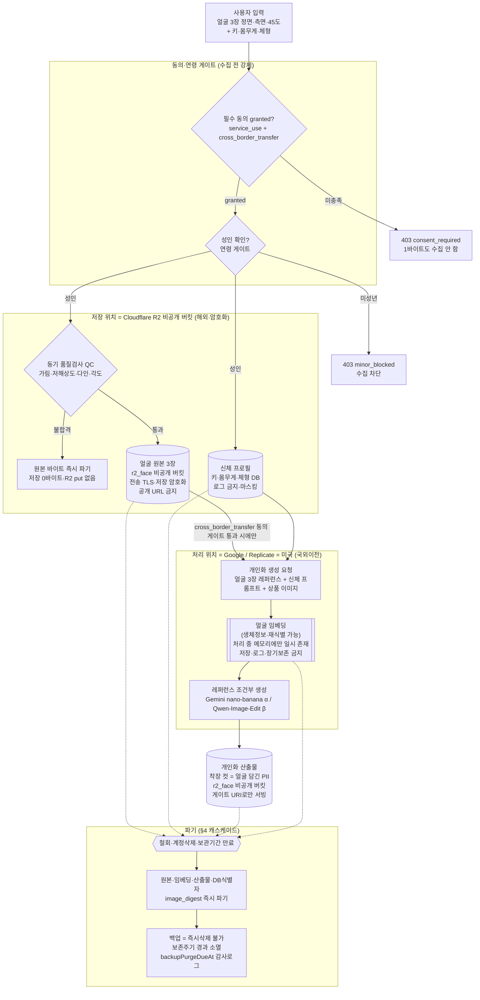

> 상태: PENDING APPROVAL — Phase 0 산출물. 실행 전 설계 문서.

# 컴플라이언스·동의 아키텍처 설계 — 사용자 얼굴·신체 개인화 AI 모델 (T0-3)

- 작성일: 2026-07-15
- 상위 문서: [스코핑 계획](../../.omc/plans/user-face-personalization-scoping.md) (이하 "계획서") · 정합 대상: [PRD](./prd.md) · [API 명세](./api-spec.md)
- 산출물 근거: 계획서 T0-3(컴플라이언스·동의 아키텍처 설계) · 계획서 [§6c 법무 체크리스트](../../.omc/plans/user-face-personalization-scoping.md#c-법무-체크리스트-개인정보보호법--생체정보)
- **면책**: 본 문서는 **법무 검토 전 초안**이며 **법률 자문이 아니다.** 개인정보보호법 조문 해석·고지 문안·보관기간 확정값은 자격 있는 법률 자문의 검토를 받아야 하며, 여기 기재한 수치·문구는 전부 **잠정(설계 기준값)**이다. 실사용자 생체정보를 처리하는 어떤 코드도 이 설계가 승인되기 전(계획서 Phase 0 게이트 이전)에는 배포하지 않는다.

---

## 0. 설계 전제 (계획서 Principle 2 — "코드보다 동의가 먼저")

얼굴 특징정보는 개인정보보호법상 **생체인식정보(민감정보)**다(법 제23조·시행령 제18조). 얼굴에서 파생되는 **임베딩(및 그 해시)도 재식별 가능한 생체정보**로 취급한다. 따라서:

- **동의·보관·삭제 아키텍처가 서기 전에는 실사용자 생체정보를 단 한 건도 수집하지 않는다**(하드 가드레일).
- 동의는 **항목별 개별 동의**이며 **포괄 동의를 금지**한다(민감정보는 별도 명시 동의).
- 저장·처리 위치가 해외이므로 **국외이전 동의를 별도**로 받는다.
- 본 설계는 [API 명세](./api-spec.md)의 동의 3종(`service_use`·`training_use`·`cross_border_transfer`)·파기 캐스케이드(§3.5)와 **정합해야 하며 어떤 항목도 모순되지 않는다**(§8 정합 확인).

---

## 1. 동의 매트릭스 (항목별 개별 동의 — 포괄 동의 금지)

동의는 업로드 전 단일 화면에서 항목별 개별 체크박스로 수집하며 **사전 체크를 금지**한다. 각 동의는 항목·문서버전(`docVersion`)·타임스탬프로 append-only 기록되어 이력 자체가 감사 증적이 된다(api-spec §3.1). 아래 3종은 api-spec의 `consent_type` enum과 1:1 대응한다.

| 동의 항목 (`consent_type`) | 필수/선택 | 수집 목적 | 보관 기간 | 파기 트리거 | 국외이전 여부 |
|---|---|---|---|---|---|
| **서비스 이용 동의** (`service_use`) | **필수** | 개인화 서비스 제공 목적의 생체정보(얼굴 3장)·신체정보(키·몸무게·체형) 수집·이용 — 민감정보 별도 명시 동의 | 보관기간(잠정 365일 = `retentionDays`, 법무 확정) 또는 철회·계정삭제 시점 중 먼저 도래하는 때까지 | ① `service_use` 철회 ② 계정 삭제 ③ 보관기간 만료(자동) → **전체 캐스케이드 파기(§4)** | 저장(R2)·생성 처리(미국)가 국외이나, 국외이전 자체의 적법 근거는 별도 `cross_border_transfer` 동의로 통제 |
| **학습 데이터 활용 동의** (`training_use`) | **선택** (서비스 이용과 **분리**, 사전 체크 금지) | 모델 개선·학습 데이터로의 활용 — 서비스 이용과 목적이 다른 별도 동의 | 학습 파이프라인 설계 시 확정 (**확정 전 학습 사본 생성 금지** — api-spec §6) | `training_use` 철회 시 **학습용 사본·파생물 한정 파기**(서비스는 유지), 또는 전체 파기에 포함 | 학습 처리 위치 확정 시 별도 고지 대상(현재 미정 — 학습 사본의 국외이전 여부는 `training_use` 파이프라인 설계 시 결정·고지) |
| **생체정보 국외이전 동의** (`cross_border_transfer`) | **필수** | 생체정보(얼굴·신체)의 국외(미국) 저장·처리 이전에 대한 동의·고지 (개인정보보호법 제28조의8) | `service_use`와 동일 — 생성 처리 후 처리자 측은 즉시 파기, 처리자 측 잔존 데이터는 계약상 파기 확인(§4) | `cross_border_transfer` 철회 = **즉시 전체 캐스케이드 파기**(저장 위치 R2 자체가 해외 → 철회 후 보관 지속 불가, api-spec §3.1) | **예** — 본 동의의 대상 자체 |

**분리 동의 보장(PRD AC-3a/3b):** 선택 항목(`training_use`)을 거부해도 개인화 생성 기능 사용에 제한이 없다. 필수 2종(`service_use`·`cross_border_transfer`)만으로 READY 도달이 가능하다(api-spec §2).

> **포괄 동의 금지 근거:** 위 3종을 하나의 체크박스로 묶는 설계는 민감정보 별도 명시 동의 위반이다. 필수/선택 혼재 묶음도 금지(선택 동의를 필수처럼 강제하는 효과).

---

## 2. 데이터 라이프사이클 — 저장 위치 + 처리 위치 명시

핵심 원칙: **저장 위치(R2, 해외)와 처리 위치(Google/Replicate = 미국)를 분리 명시**한다. 국외이전 동의·고지는 이 둘을 모두 대상으로 한다. **얼굴 임베딩은 생성 처리 중 메모리에만 일시 존재하며 저장·로그되지 않는다**(§5).

**라이프사이클 단계 요약:**

| 단계 | 위치 | 데이터 | 통제 |
|---|---|---|---|
| 수집 | 클라이언트 → 서버(서버발 multipart) | 얼굴 3장 + 키·몸무게·체형 | 필수 동의 + 연령 게이트 미통과 시 1바이트도 수집 안 함 |
| 저장 | **Cloudflare R2 비공개 버킷(해외)** | 얼굴 원본(QC 통과분만) | 전송 TLS + 저장 암호화, 공개 URL 금지, 인증 게이트 스트림만 |
| 처리 | **Google / Replicate = 미국** | 얼굴 레퍼런스 + 신체 프롬프트 + 상품 이미지 → 착장 컷 | `cross_border_transfer` 동의 없이는 얼굴 바이트가 외부 API로 나가지 않음(코드 게이트) |
| (파생) | **처리 중 메모리만** | 얼굴 임베딩 | 저장·로그·장기보존 금지, 판정/처리 직후 즉시 소멸 |
| 사용 | R2 비공개 버킷(산출물) | 개인화 착장 컷(얼굴 담긴 PII) | 표준 asset 파이프라인(공개 버킷) 금지, 게이트 URI만 |
| 파기 | 전 구간 | 원본·임베딩·산출물·DB식별자·백업 | §4 캐스케이드, 감사로그 |

---

## 3. 개인정보보호법 대응 표 (계획서 §6c 체크리스트 전 항목)

계획서 §6c 법무 체크리스트 **9개 항목** 각각에 대한 설계상 대응 방식.

| # | §6c 체크리스트 항목 | 설계상 대응 방식 (1줄) |
|---|---|---|
| 1 | **민감정보 별도 명시 동의** (얼굴 특징정보 = 민감정보, 포괄 동의 불가) | `service_use`를 독립 체크박스·별도 명시 동의로 수집, 사전 체크 금지, 동의 없이는 업로드 라우트가 403 `consent_required`로 1바이트도 받지 않음(api-spec §3.2). |
| 2 | **이용 ↔ 학습 동의 분리** (목적별 개별 동의) | `service_use`(필수)와 `training_use`(선택)를 별도 `consent_type`으로 분리, 선택 거부해도 생성 기능 무제한(PRD AC-3b), 학습 사본은 `training_use` 파이프라인 확정 전 생성 금지. |
| 3 | **보관기간 명시 + 만료 시 자동 파기** | `retentionDays`(잠정 365, 법무 확정)를 동의 화면·고지 URI에 명시, 만료 시 스케줄러가 수동 철회와 동일한 `personalization_purge` 잡을 자동 생성(api-spec §3.5). |
| 4 | **삭제 = 백업·파생물(임베딩·개인화 모델) 포함 완전 파기** | 파기 캐스케이드가 원본·임베딩·산출물·DB식별자(`image_digest`)·백업까지 대상으로 하며, 백업은 보존주기 경과 소멸 + `backupPurgeDueAt` 감사로그(§4, api-spec §3.5 6단계). |
| 5 | **제3자 제공 고지** (원칙적 미제공) | 동의 화면·`noticeUris.thirdParty` 고지 문서에 "원칙적 미제공"을 명시, 생성 처리자로의 전송은 "제공"이 아니라 국외이전(위탁·이전) 범주로 §3-8·§1의 `cross_border_transfer`로 별도 통제. |
| 6 | **철회·계정삭제 캐스케이드** (개인화 산출물까지 연쇄 삭제) | 필수 동의 철회·계정 삭제가 모두 `POST /v1/personalization:withdraw`의 단일 종착 경로로 수렴해 산출물까지 연쇄 파기, 별도 축약 경로 금지(PRD AC-8b-3, api-spec §3.5). |
| 7 | **미성년자 차단** (초기 차단 권장) | 연령 게이트를 동의 제출·업로드·생성 3지점에서 재검사하고 미성년 판별 시 403 `minor_blocked`, 법정대리인 동의 플로우는 MVP 미도입(§6, PRD N2). |
| 8 | **생체정보 국외이전 동의** (처리 위치 미국 → 별도 동의·고지) | `cross_border_transfer`를 필수 동의로 분리, 미동의 시 얼굴 바이트가 외부 API로 나가지 않는 코드 게이트, 제28조의8 필수 고지사항 전부 문안화(§3-8 표). |
| 9 | **저장 암호화·접근 통제·감사로그** | 얼굴은 R2 비공개 버킷 + 전송 TLS·저장 암호화, `` 금지·인증 게이트 `fetch+objectURL`만(FaceMarket `get_license_face` 선례), 접근·파기 이벤트는 `personalization_audit_log`에 PII 없이 기록(api-spec §5). |

### 3-8. 개인정보보호법 제28조의8(개인정보의 국외 이전) 필수 고지사항

제28조의8 제2항의 고지 요소를 `cross_border_transfer` 동의 화면·고지 문서(`noticeUris.crossBorder`)에 **전부** 표기한다. 아래 값은 **설계 기준 잠정값**이며 채택 경로(스파이크 T0-2의 α/β/γ)·법무 검토로 확정한다.

| 법정 고지 요소 (제28조의8 제2항) | 설계상 기재값 (잠정) |
|---|---|
| **이전되는 개인정보 항목** | 얼굴 이미지 3장(정면/측면/45도), 얼굴에서 파생되는 임베딩(처리 중 일시), 신체 프로필(키·몸무게·체형), 상품 이미지 |
| **이전되는 국가** | 미국(United States) |
| **이전 시기** | 개인화 생성 요청 시점(실시간, 사용자 요청 트리거 시) |
| **이전 방법** | TLS 암호화 API 호출을 통한 전송(저장은 R2 비공개 버킷, 처리는 생성 엔드포인트) |
| **이전받는 자의 명칭** | 저장: Cloudflare, Inc. / 처리: Google LLC(Gemini API, 경로 α) 또는 Replicate, Inc.(Qwen-Image-Edit, 경로 β) — 채택 경로 확정 후 단일화 |
| **이전받는 자의 연락처** | 각 사업자 개인정보 처리방침·DPO 연락처(법무 확정) |
| **이전받는 자의 이용 목적** | 개인화 착장 컷 생성(레퍼런스 조건부 이미지 생성)에 한정 |
| **이전받는 자의 보유·이용 기간** | 생성 처리에 필요한 최소 기간, 처리 후 즉시 파기(처리자 측 잔존 데이터는 계약상 파기 확인 — §4) |
| **동의 거부권** | 사용자는 국외이전 동의를 거부할 수 있음(체크박스 사전 체크 금지) |
| **거부 시 불이익** | 저장·처리 위치가 해외이므로 국외이전 미동의 시 개인화 생성 기능 이용 불가(단, 서비스 그 외 기능은 영향 없음) |

> PRD AC-4a 및 FR-3과 동일 요소 집합이다. 문안 최종본은 §6 "동의 문안·국외이전 고지 문구 법무 검토"에서 확정한다.

---

## 4. 파기 캐스케이드 설계 (api-spec §3.5와 정합)

트리거: **① `service_use` 철회 ② `cross_border_transfer` 철회(즉시 전체 파기) ③ 계정 삭제 ④ 보관기간 만료(자동) ⑤ 전체 삭제 요청(PRD US-8b)** — 전부 `POST /v1/personalization:withdraw`의 **단일 종착 경로**로 수렴한다(별도 축약 경로 금지). `training_use` 철회만 학습 사본 한정 파기로 분기한다.

프로필 상태는 `draft|ready → purging → purged`로 전이하며(api-spec §2), `purging` 중 모든 쓰기 라우트는 409 `purge_in_progress`, `purged` 후 리소스 조회는 404(존재 은닉)다.

**캐스케이드 단계 (전부 완료해야 `purged` — api-spec §3.5 워커 명세와 정합. 단계 1~6은 §3.5 워커 단계에 대응하고, 7(외부 처리자)은 PRD FR-7, 감사로그는 §3.5-7에 매핑):**

| 단계 | 파기 대상 | 방식 | 근거 |
|---|---|---|---|
| 1 | 얼굴 원본 3장 | R2 비공개 버킷 delete(+객체 버저닝 시 전 버전) | api-spec §3.5-1 |
| 2 | DB 식별자 (`r2_key`·`image_digest`·`byte_size`) | `personalization_face_photos` 행 **hard delete** | api-spec §3.5-2 — `image_digest`는 생체 원본 파생 고정 식별자로 **후보 사진 대조 시 등록 여부를 확인할 수 있는 멤버십 테스트 벡터** → 잔존 절대 금지 |
| 3 | 얼굴 임베딩·QC 파생물 | 정상 경로엔 0건(저장 금지) → 잡이 캐시 키스페이스 방어적 스캔·삭제(존재 시 버그, 감사로그에 카운트) | api-spec §3.5-3, §5 |
| 4 | 개인화 산출물 | 생성 착장 컷(R2 객체 + asset/generation 행) 전량 삭제 | api-spec §3.5-4 |
| 5 | 신체 프로필 값 | 행에서 null 처리(행 자체는 파기 증적으로 `purged_at`과 함께 유지) | api-spec §3.5-5 |
| 6 | **백업** (DB PITR·R2 스냅샷) | **즉시 삭제 불가** → 백업 보존주기(운영 확정값, 예: ≤30일) 경과로 완전 소멸, 잡이 `backupPurgeDueAt`을 감사로그에 기록 | api-spec §3.5-6 — 동의 고지 문구와 반드시 일치 |
| 7 | 외부 처리자 측 잔존 데이터 | 계약상 파기 확인(Google/Replicate/Cloudflare) | PRD FR-7 |
| — | 감사로그 | `purge_started`/`purge_completed`(+단계별 카운트) — **PII 없음**, id·카운트·타임스탬프만 | api-spec §3.5-7, §5 |

**"파기 완료"의 정의(PRD AC-9b):** 즉시 파기 대상(원본·임베딩·산출물·DB식별자)의 완료(= `purged` 전이) 시점. 그 이후 해당 사용자 생체 데이터로 어떤 API도 200을 반환하지 않는다. **백업 소멸은 별도 만기 이벤트(`backupPurgeDueAt`)로 관리**하며, 즉시 삭제 불가 사실을 동의 고지에 명시해 백업 보존주기와 고지 문구를 일치시킨다.

---

## 5. 얼굴 임베딩 취급 (생체정보 — 재식별 가능)

**임베딩은 얼굴 원본과 동등한 생체정보로 취급한다**(재식별 가능). 계획서 §6d·api-spec §1.4·§5의 하드 룰을 그대로 승계한다.

- **저장 금지·로그 금지·장기보존 금지.** 임베딩은 생성 처리 중 메모리에만 일시 존재하고 판정/처리 직후 즉시 소멸한다. DB에는 상태 enum(`qc_status`)·QC 사유코드·집계 카운트만 남는다.
- **임베딩 해시도 생체정보.** 해시라도 멤버십 테스트(등록 여부 대조)가 가능하므로 로그·메트릭·감사로그·job payload·에러 메시지에 미포함한다.
- **파기 캐스케이드에 임베딩·해시 포함**(§4-3). 정상 경로엔 0건이지만, 파기 잡이 캐시 키스페이스를 방어적으로 스캔·삭제하고 존재 시 감사로그에 카운트를 남긴다(존재 자체가 버그 신호).
- **`image_digest`(원본 SRI 해시)도 동일 위험**이므로 파기 시 hard delete(§4-2). 로그·메트릭에는 원본 이미지·식별 가능 데이터를 일절 넣지 않고 상태·집계 스코어만 기록한다.

---

## 6. 미성년자 차단 (MVP — 연령 게이트)

> ✅ **구현 완료(2026-07-15) — T2-1 결착.** 연령 소스 = **CX 표준인증창 본인확인**(`POST /v1/personalization/identity:verify`, api-spec §3.0). 검토했던 라이브니스는 '생존 확인'이라 연령 소스가 아니었고, OpenDID 배선은 얼굴 라이선스 VC 전용이라 신원·연령 VC가 아니었다 — 검증된 생년월일을 실제로 주는 수단은 CX뿐. `_assert_age_eligible` 단일 훅이 4개 호출부(동의·업로드·생성·보정)에 배선됨. **저장은 `is_adult` 불리언만** — 생년월일·CI 미보관(최소수집).
> **잔여**: 사칭 방지(T2-2, 업로드 얼굴 = 계정 본인)는 별개 미결 — CX는 *계정 보유자 신원*을 증명하지 *얼굴이 본인인지*는 증명하지 않는다.

- MVP는 **미성년자 지원 없음**(PRD N2). 법정대리인 동의 플로우 없이 **차단**한다.
- **연령 게이트를 동의·업로드·생성 전 3지점에서 재검사**한다(우회 방지):
  1. **동의 제출 시**(`POST /v1/personalization/consents`): 미성년 판별 시 403 `minor_blocked`, 어떤 동의도 기록하지 않음.
  2. **업로드 시**(`POST /v1/personalization/face-photos`): 동의 존재 여부와 무관하게 재검사(동의 후 판별 정보 갱신 대응), 미성년 시 403 `minor_blocked`.
  3. **생성 시**(`POST /v1/personalization/generations`): 서버 게이트 ③에서 재검사(api-spec §4).
- 딥링크·API 직접 호출 등 클라이언트 우회 경로는 **서버측에서 차단**(PRD AC-10a). 연령 게이트 판별 수단은 Phase 2 T2-1에서 사칭 방지 게이트와 함께 확정(api-spec §6).

---

## 7. 종업원 동의의 자유성 (스파이크 피험자)

계획서 Pre-mortem 3·T0-2 미니 게이트를 승계한다. 스파이크(T0-2)에서 팀원 얼굴을 피험자로 쓰면 **고용주-종업원 관계로 동의의 자유성(임의성)이 다툼**될 수 있다(강압성 리스크).

- **우선순위: 합성 얼굴 · 본인(창업자 자기동의) 얼굴 우선.** 제3 팀원 얼굴은 지양한다.
- 부득이 팀원 얼굴을 쓸 경우: **자유의사 서면 동의(목적·파기 명시) + 스파이크 종료 시 원본 얼굴·임베딩 전량 파기**를 착수 전 미니 게이트로 강제(계획서 T0-2).
- Downloads의 "모바일신분증 API 샘플" 등 외부 신원 자산도 이 기능에 전용 금지(계획서 Pre-mortem 3).
- 스파이크가 처리하는 팀원 얼굴+임베딩도 §5의 생체정보 규율 대상이다.

---

## 8. FaceMarket 경계 — 본인 개인화 vs 타인 얼굴 라이선스

동일한 "얼굴=비공개 R2+게이트" 저장 선례(`server/app/facemarket.py`, `src/features/model/ModelLicense.jsx`)를 **인프라로는 재사용**하되, **동의의 주체·목적은 완전히 분리**한다.

| 구분 | 본인 개인화 (본 기능) | 타인 얼굴 라이선스 (FaceMarket) |
|---|---|---|
| **주체** | 계정 본인 | 검증 모델(얼굴 제공자) |
| **목적** | 본인 사용(내 착장 컷 생성) | 판매(셀러가 상세페이지 제작에 라이선스 구매·사용) |
| **동의 성격** | 본인 생체정보 수집·이용·국외이전 동의 | 모델이 자기 얼굴의 상업적 사용 조건(허용/금지 브랜드·단가·유효기간)을 라이선스로 부여 |
| **대상 얼굴** | 계정 본인 얼굴만(타인 얼굴 등록 금지, PRD N4) | 검증된 모델 본인 얼굴 |
| **재사용 접점** | R2 비공개 버킷·게이트 스트림·`no-store, private`·공개 URL 금지 패턴 공유 | 동일 저장 패턴의 원조 선례 |

**신원검증 인프라(DID/VC) 재사용 — 목적 분리 유지:** FaceMarket의 OpenDID/VC·CX 표준인증창 자산은 **사칭 방지 게이트(업로드 얼굴 = 계정 본인 검증, PRD FR-9)**에 재사용을 검토할 수 있다(계획서 §8). 단 이는 **"사칭 방지"라는 목적의 인프라 재사용일 뿐, 동의의 목적을 합치는 것이 아니다.** 본인 개인화 동의(생체정보 수집·국외이전)와 FaceMarket 라이선스 동의(타인에게 상업 사용 부여)는 법적 성격이 다르므로 동의 문서·이력·파기 경로를 분리 관리한다.

---

## 9. api-spec / PRD 정합 확인

본 설계는 다음을 [API 명세](./api-spec.md)·[PRD](./prd.md)와 대조해 **모순 없음**을 확인했다:

- **동의 3종**: §1 매트릭스 ↔ api-spec §3.1 `consent_type`(`service_use`·`training_use`·`cross_border_transfer`) 및 필수/선택 구분 일치.
- **파기 캐스케이드**: §4 7단계 ↔ api-spec §3.5 워커 명세 1:1(원본·`image_digest` hard delete·임베딩 방어 스캔·산출물·신체값 null·백업 `backupPurgeDueAt`·감사로그). "파기 완료" 정의 = PRD AC-9b와 동일.
- **국외이전**: §3-8 제28조의8 고지 요소 ↔ PRD AC-4a·FR-3 요소 집합 동일. `cross_border_transfer` 철회 = 즉시 전체 파기 ↔ api-spec §3.1 일치.
- **미성년자 3지점 재검사** ↔ api-spec §3.1(동의)·§3.2(업로드)·§4(생성) 게이트 지점 일치.
- **보관기간·백업 보존주기**: 잠정값(365일·≤30일)으로 표기, 법무·운영 확정 대상임을 api-spec §6와 동일하게 명시(확정값을 SLA로 커밋하지 않음).
- **임베딩 로그 금지** ↔ api-spec §1.4·§5, 계획서 §6d 하드 룰 승계.

> 잠정값(보관기간·백업 주기·이전받는 자 연락처·고지 문안)은 법무 확정 전까지 설계 기준값이며, 확정 시 본 문서·api-spec·PRD를 **동시 갱신**한다(단일 소스 원칙).
