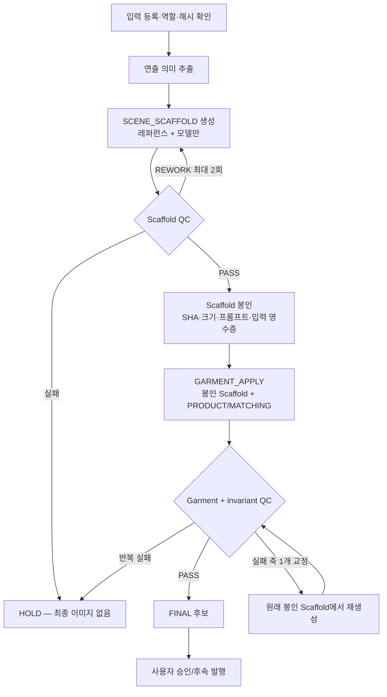

# 2단계 착용 이미지 파이프라인 설계안

상태: **실험 검증 중인 Working Specification**  
작성일: 2026-08-18  
대상: Wearless `styling/direct` 착용 이미지 생성  
실험 증거: `reference/genexamples/prompt-experiments/two_stage_scene_model_garment_edit_2026-08-18/`

## 0. 결론부터

Wearless의 착용 이미지 생성은 다음 두 실행으로 분리할 가치가 있다.

1. **`SCENE_SCAFFOLD`**: 연출 레퍼런스와 모델만으로, 사람과 공간을 한 번에 렌더링한 완성형 아이폰 스냅 캔버스를 만든다. 셀러 의류 이미지는 이 호출에 절대 넣지 않는다.
2. **`GARMENT_APPLY`**: 승인·봉인된 캔버스를 편집 대상으로 삼고, 상품 의류만 적용한다. 레퍼런스와 모델 이미지를 다시 넣지 않는다.

단, “다른 것은 고정”을 **같은 RGB 픽셀 보장**이라고 표현하면 안 된다. 현재 이미지 생성기는 장면 전체를 다시 렌더링한다. 서비스 계약은 얼굴·포즈·손·발·카메라·배경 구조·광원 같은 **의미/구조 불변 조건**과, 의류 경계 주변에서만 허용되는 **물리적 변화 영역**으로 정의해야 한다.

이 방식은 과거의 빈 배경판 선행 방식이 아니다. `SCENE_SCAFFOLD`에는 이미 모델, 포즈, 손·발 접촉, 조명, 임시 중립 의류가 모두 합쳐져 있다.

## 1. 정본과의 관계

이 설계는 ADR-0004~0011, `documents/reference_directed_generation_example_pipeline.md`, `documents/ai_pipeline_spec.md`의 입력 권한 분리를 유지한다.

- 연출 레퍼런스는 포즈·카메라·장소 유형·촬영 등급의 정본이다.
- 모델 얼굴/전신은 정체성·체형의 정본이다.
- PRODUCT/MATCHING은 최종 의류의 유일한 정본이다.
- 생성예시나 연출 레퍼런스의 의류는 서비스 결과로 전달하지 않는다.
- `all | pose | bg`의 자산 의미를 바꾸지 않는다.
- 이 설계는 새 `cutType`, `refScope`, 생성예시 family가 아니라 `styling/direct` 내부의 선택적 실행 전략이다.

기존 런타임에서 “1차/2차”는 생성과 QC 교정을 가리키는 문맥이 있어 혼동된다. 코드·로그·문서에는 반드시 `SCENE_SCAFFOLD`, `GARMENT_APPLY`, `QC_REPAIR`라는 이름을 사용한다.

이 문서가 승인돼 운영 기본값을 바꾸게 되면 별도 ADR로 승격한다. 현재는 실험 제안이며 정본을 덮어쓰지 않는다.

## 2. 한 문장 계약

> `SCENE_SCAFFOLD`는 연출과 모델을 확정하고, `GARMENT_APPLY`는 그 봉인된 캔버스의 의류와 의류 때문에 필연적으로 달라지는 국소 물리만 바꾼다.

## 3. 용어

| 용어 | 의미 | 최종 결과 권한 |
|---|---|---|
| `DIRECTING_REFERENCE` | 포즈·행동·카메라·프레이밍·장소 계열·광원·촬영 등급 근거 | 의류/인물 정체성 없음 |
| `MODEL_FACE` | 얼굴 정체성 근거 | 포즈·의류·장소 권한 없음 |
| `MODEL_BODY` | 체형과 비율 근거 | 포즈·의류·장소 권한 없음 |
| `SCENE_SCAFFOLD` | 모델과 공간이 통합된 임시 편집 캔버스 | 최종 발행 금지 |
| `EDIT_ENVELOPE` | 선택적인 중립 의류 커버리지/접촉 구조 | 상품 디자인 권한 없음 |
| `PRODUCT` | 주 상품 의류 증거 | 해당 의류만 |
| `MATCHING` | 코디 의류 증거 | 해당 코디 의류만 |
| `GARMENT_APPLY` | 봉인 캔버스에 PRODUCT/MATCHING을 적용한 결과 | QC PASS 시에만 FINAL 후보 |
| `PHYSICAL_HALO` | 의류 경계 변화 때문에 국소적으로 달라질 수 있는 피부·머리·배경·그림자 범위 | 최소 필요 변화만 허용 |

## 4. 전체 흐름



금지되는 흐름:

- 빈 배경 → 사람 합성
- 실패한 `SCENE_SCAFFOLD`를 의류 적용으로 밀어 넣기
- 제품 A 결과를 다시 편집해 제품 B 만들기
- `GARMENT_APPLY` 실패 시 임시 중립 의류가 든 scaffold를 반환하기
- 현재 원샷 결과를 scaffold처럼 재사용하기

## 5. 사전 준비

### 5.1 입력 역할을 위치가 아니라 이름으로 고정한다

현재 일부 생성 경로는 positional tuple에 의존한다. 새 실행 경로는 명시적 객체를 사용한다.

```json
{
  "directingReference": {"assetId": "...", "sha256": "..."},
  "modelFace": {"assetId": "...", "sha256": "..."},
  "modelBody": {"assetId": "...", "sha256": "..."},
  "shot": "full",
  "direction": "front",
  "faceExposure": {
    "state": "partial",
    "mechanism": "top-edge crop below eyes"
  },
  "directingProfile": {
    "action": "reach_for_cup",
    "supportSide": "rear_leg",
    "leftArm": "reach_to_cup",
    "rightArm": "hand_in_pocket",
    "camera": "slightly-high handheld 1x phone",
    "captureClass": "ordinary iPhone snapshot"
  }
}
```

사용자가 올린 일반 `refAssetIds`는 현재 mood 역할이다. 포즈·카메라 권한을 주려면 `directingReferenceAssetId` 또는 동등한 명시적 역할을 새로 둔다. mood 입력의 권한을 조용히 확장하지 않는다.

### 5.2 모델 참조는 fail-closed

요청한 모델의 얼굴·전신 쌍 중 하나가 없거나 서로 다른 SID이면 생성하지 않는다. 다른 모델이나 예시 이미지로 폴백하지 않는다.

### 5.3 연출 의미를 먼저 구조화한다

좌표를 복사하는 것이 아니라 다음을 기록한다.

- 행동과 접촉 대상
- 왼쪽/오른쪽 팔다리 역할
- 지지 다리와 보행/기대기 상태
- 어깨·골반 방향과 의도된 비대칭
- 고개·시선
- 카메라 높이·거리·원근·피사체 비율
- 얼굴 노출 상태와 그 메커니즘
- 장소 기능, 시간대, 광원 방향, 화이트밸런스, 촬영 등급

## 6. `SCENE_SCAFFOLD` 계약

### 6.1 입력

필수:

- `DIRECTING_REFERENCE`
- `MODEL_FACE` — 얼굴이 보여야 할 때
- `MODEL_BODY`
- shot/direction/face-exposure/directing profile

금지:

- PRODUCT/MATCHING 이미지
- 상품명, 브랜드, 색상, 그래픽, 워싱, 정확한 봉제선 등 상품 정체성
- 이전 최종 이미지

### 6.2 출력

빈 공간판이 아니라 다음이 이미 완성된 한 장의 통합 사진이다.

- 새롭지만 관련 있는 생활 공간
- 선택 모델 얼굴/체형
- 레퍼런스가 지시한 포즈·카메라·얼굴 노출
- 한 광원 아래 결합된 모델·임시 옷·바닥·배경
- 아이폰 일상 스냅 촬영 등급
- 임시 중립 의류

### 6.3 임시 의류 정책

기본 계약인 `STRICT_ZERO_PRODUCT`는 상품 관련 입력을 전혀 사용하지 않는다. 무지 회색 상의, 무지 진회색 하의, 무지 검정 신발처럼 구별 가능한 중립 의류를 쓴다. 임시 의류는 서비스 결과도, PRODUCT 대체물도 아니다.

선택 실험인 `EDIT_ENVELOPE`는 **상품 픽셀과 상품 정체성을 사용하지 않고** 교체 영역의 거친 구조만 명시한다.

```json
{
  "upperCoverage": "short-sleeve crew-neck shell",
  "lowerCoverage": "full-length wide pants",
  "contactAffordances": ["right-front-pocket"],
  "layers": 1,
  "requiredVisibleRegions": ["upper-front", "waist", "full-leg"]
}
```

허용하지 않는 값:

- 상품 색상·로고·문구·패턴
- 정확한 칼라/단추/지퍼/스티치 위치
- 상품 고유 워싱·장식·실루엣 수치
- PRODUCT 이미지를 분석해 만든 상세 설명

즉, 사용자가 말한 “1차에는 의류 인풋을 사용하지 않는다”가 절대 규칙이면 `STRICT_ZERO_PRODUCT`를 쓴다. `EDIT_ENVELOPE`는 별도 실험 플래그이며, 운영 채택 전 제품 결정이 필요하다.

### 6.4 프롬프트 순서

1. asset type과 실행명
2. 입력별 권한
3. 관련 있지만 다른 scene/backdrop
4. 모델 정체성·체형
5. 카메라·포즈·얼굴 노출
6. 임시 중립 의류
7. 광원·촬영 등급
8. 비복제·비화보·해부학 제약

`SCENE_SCAFFOLD` 프롬프트는 “빈 배경을 먼저 만들라”거나 “나중에 합성할 여백을 만들라”고 말하지 않는다. 사람과 공간을 한 번에 직접 생성한다.

### 6.5 Scaffold QC

PRODUCT가 없으므로 기존 garment QC를 재사용하지 않는다. 다음만 판정한다.

- 레퍼런스의 행동·좌우·체중·접촉·카메라·프레이밍
- 얼굴 노출 메커니즘
- 모델 정체성·체형
- 관련 있지만 다른 장소
- 아이폰 스냅 등급과 원본 색감
- 한 광원, 접지, 손·발·해부학
- 원본 사람/의류/장소 픽셀/로고 누출 없음
- 임시 의류가 무지·중립이며 편집 가능한 경계를 가짐

상태는 `PASS | REWORK | HOLD | JUDGE_ERROR`다. `UNJUDGEABLE`과 `JUDGE_ERROR`는 승인할 수 없다.

## 7. Scaffold 봉인 영수증

QC PASS 직후 다음을 저장한다.

```json
{
  "scaffoldId": "scf_...",
  "assetSha256": "...",
  "mimeType": "image/png",
  "width": 1115,
  "height": 1410,
  "promptSha256": "...",
  "orderedInputs": [
    {"role": "DIRECTING_REFERENCE", "sha256": "..."},
    {"role": "MODEL_FACE", "sha256": "..."},
    {"role": "MODEL_BODY", "sha256": "..."}
  ],
  "provider": "...",
  "model": "...",
  "faceExposureMechanism": "top-edge crop below eyes",
  "directingProfileSha256": "...",
  "status": "SEALED"
}
```

이후 모든 상품 분기는 같은 SHA의 원본 scaffold에서 시작한다. 이미지 크기가 바뀌거나 SHA가 다른 입력이 들어오면 즉시 실패한다.

## 8. `GARMENT_APPLY` 계약

### 8.1 입력

- 봉인된 `SCENE_SCAFFOLD` 한 장
- PRODUCT 앞/뒤/디테일 증거
- 필요한 MATCHING 의류 증거
- 바꿀 의류 slot 목록

생성 호출에 다시 넣지 않는 것:

- `DIRECTING_REFERENCE`
- `MODEL_FACE`
- `MODEL_BODY`
- 다른 제품의 완성 결과

이 권한 분리가 중요하다. 레퍼런스와 모델을 다시 주면 생성기가 두 번째로 포즈·얼굴·공간을 해석할 수 있다. Stage 2에서 이들의 역할은 **생성 입력이 아니라 QC 비교 근거**다.

### 8.2 의류 정본

각 slot은 하나의 정본만 가진다.

- `featuredTop` ← PRODUCT top images
- `featuredOuter` ← PRODUCT outer images
- `matchingBottom` ← MATCHING bottom images
- `matchingShoes` ← MATCHING shoes 또는 중립 정책

앞/뒤/디테일은 같은 상품 ID로 묶여야 한다. 서로 다른 상품 이미지를 한 slot에 섞지 않는다.

### 8.3 고정 영역과 허용 변화

고정해야 하는 의미/구조:

- 얼굴, 표정, 고개, 시선, 얼굴 노출 범위
- 머리 형태와 큰 흐름
- 뼈대 포즈, 좌우 팔다리, 손·발, 체중 지지
- 카메라, 렌즈 원근, crop, 피사체 스케일
- 배경 구조, 소품 수와 위치, 간판/문자 상태
- 전체 노출, 화이트밸런스, 촬영 텍스처

바꿀 수 있는 것:

- 대상 의류의 색·재질·구조·핏·문구·패턴
- 새 옷에 필요한 주름·당김·눌림
- 포켓·소매·밑단과 손/피부의 국소 가림 관계
- 의류가 새로 가리거나 드러내는 아주 작은 피부·머리·배경 영역
- 새 의류의 캐스트 섀도·반사·주변색

이를 `garment mask + PHYSICAL_HALO`로 표현한다. provider가 명시적 mask를 지원하면 mask 밖 변경을 최소화하는 경로를 별도 실험한다. 지원하지 않으면 프롬프트만으로 픽셀 고정을 보장한다고 쓰지 않고, invariant QC로 fail-closed한다.

### 8.4 프롬프트 순서

1. `identity-preserve / GARMENT_APPLY`
2. scaffold와 상품 이미지의 역할
3. 바꿀 slot과 상품 구조
4. 고정할 얼굴·포즈·카메라·배경 불변 조건
5. 의류 경계에서 허용되는 물리 변화
6. 광원·그림자 연속성
7. 금지 변화와 출력 형식

## 9. `GARMENT_APPLY` QC

한 번의 판정에서 세 화면을 본다.

1. **연출 화면**: DIRECTING_REFERENCE ↔ FINAL
2. **상품 화면**: PRODUCT/MATCHING ↔ FINAL
3. **불변 화면**: SEALED_SCAFFOLD ↔ FINAL

검사 축:

| 축 | 하드 실패 예시 |
|---|---|
| 상품 상의/아우터/하의 | 색·구조·재질·핏·문구·여밈 불일치 |
| 얼굴/머리/피부 drift | 얼굴 노출 증가, 다른 얼굴, 헤어 재설계 |
| 포즈/손/발 drift | 좌우 반전, 접촉 해제, 체중 변경, 떠 있는 발 |
| 카메라/crop drift | 피사체 크기·상단 crop·양발 가시성 변경 |
| 배경/소품 drift | 창·탁자·컵·식물·문 구조 이동/소실/추가 |
| 노출/WB drift | 시간대나 빛 방향 변경, 화보화 |
| 의류 물리 | 포켓 손 불가능, 주름이 포즈와 무관, 그림자 불일치 |
| 편집 경계 | 피부/배경 번짐, halo, 임시 옷 잔존 |

권장 실패 코드:

- `S1_REFERENCE_DRIFT`, `S1_PLACE_COPY`, `S1_PLACE_JUMP`, `S1_IDENTITY`, `S1_CAPTURE_UPGRADE`, `S1_PHYSICS`, `S1_AFFORDANCE`, `S1_SOURCE_LEAKAGE`
- `S2_PRIMARY_GARMENT`, `S2_MATCHING_GARMENT`, `S2_TEXT_LOGO`, `S2_FIT_TOPOLOGY`, `S2_PLACEHOLDER_LEAKAGE`, `S2_FACE_HAIR_SKIN_DRIFT`, `S2_POSE_HAND_FOOT_DRIFT`, `S2_BACKGROUND_PROP_DRIFT`, `S2_CAMERA_CROP_DRIFT`, `S2_EXPOSURE_WB_DRIFT`, `S2_DRAPE_LIGHT_CONTACT`, `S2_EDIT_BOUNDARY`, `S2_REPAIR_REGRESSION`

### 9.1 교정

- 최초 1회 + 교정 최대 2회.
- 실패한 축 하나만 교정한다.
- 매 교정은 **동일한 봉인 scaffold**에서 다시 시작한다.
- 통과한 다른 slot을 건드리지 않는다.
- 연속 실패 시 품질 기준을 낮추지 않고 HOLD.

현재의 일반 `repair()`는 한 장의 결과를 보존하며 고치는 계약이라 `GARMENT_APPLY`에 그대로 쓰지 않는다. 새 `apply_garments()`와 전용 repair 계약이 필요하다.

## 10. 실패·폴백 정책

| 실패 | 서비스 행동 |
|---|---|
| 모델 참조 없음/불일치 | 즉시 실패; 다른 모델 폴백 금지 |
| Scaffold QC 실패 | HOLD; garment call 금지 |
| Scaffold 봉인 검증 실패 | 즉시 실패; 재생성 |
| Garment fidelity 실패 | 같은 scaffold에서 slot 교정 |
| 비의류 drift 실패 | 같은 scaffold에서 invariant 교정 |
| 반복 실패 | HOLD/빈 슬롯 |
| QC judge 오류 | 승인 금지; 재검사 또는 HOLD |
| feature flag 꺼짐 | 기존 원샷 경로를 그대로 사용 |

placeholder 의류는 절대 사용자에게 최종 결과로 보이지 않는다. 이 경로는 기존 fail-open 동작과 분리해 fail-closed해야 한다.

## 11. 서비스 데이터 계약 초안

```json
{
  "executionMode": "two_stage_scene_scaffold",
  "scaffold": {
    "policy": "STRICT_ZERO_PRODUCT",
    "directingReferenceAssetId": "asset_ref_...",
    "modelFaceAssetId": "asset_face_...",
    "modelBodyAssetId": "asset_body_...",
    "directingProfile": {},
    "editEnvelope": null
  },
  "garmentApply": {
    "scaffoldReceiptId": "scf_...",
    "slots": [
      {"slot": "featuredTop", "assetIds": ["top_front", "top_back"]},
      {"slot": "matchingBottom", "assetIds": ["bottom_front", "bottom_detail"]}
    ],
    "lockPolicy": "SEMANTIC_INVARIANTS_PLUS_PHYSICAL_HALO"
  },
  "qcPolicy": {
    "maxScaffoldRepairs": 2,
    "maxGarmentRepairs": 2,
    "failClosed": true
  }
}
```

결과 메타데이터에는 최소 다음을 보존한다.

- execution mode와 feature-flag 버전
- scaffold receipt와 SHA
- 각 입력 role/asset ID/SHA
- scaffold/apply prompt SHA
- provider/model/size
- 각 호출 지연과 시도 수
- QC 판정·실패 코드·judge 버전
- 최종 이미지 SHA·크기
- 사용자 승인 여부

## 12. 현 코드에 넣을 위치

현재 생성 조립과 호출은 주로 `server/app/workers/detail_page_job.py`에 모여 있다.

- PRODUCT/MATCHING/MODEL 조립: 약 1195~1207행
- 생성예시/manifest 조립: 약 1211~1366행
- 최초 생성 호출: 약 320~324행
- product best-of: 약 408~445행
- 독립 QC/repair: 약 447~525행
- 최종 R2 저장: 약 536~559행

최소 변경 지점은 기존 최초 생성 호출 직전이다.

```text
if featureFlag.twoStageSceneScaffold:
    scaffold = generate_scene_scaffold(...)
    scaffold_qc = judge_scene_scaffold(...)
    sealed = seal(scaffold)
    final = apply_garments(sealed, products, matching)
    final_qc = judge_garment_and_invariants(...)
else:
    final = existing_single_pass_generate(...)

existing_final_storage(final)
```

권장 신규 경계:

- `server/app/agents/two_stage_worn_experiment.py`
- `server/prompts/scene_scaffold_v1.txt`
- `server/prompts/garment_apply_v1.txt`
- `server/app/agents/directing_scaffold_qc.py`
- `server/app/agents/garment_apply_qc.py`
- `server/scripts/experiment_two_stage_worn.py`

기존 `server/prompts/cut_generate_v1.txt`는 PRODUCT가 있는 원샷을 전제로 하므로 scaffold 프롬프트로 재사용하지 않는다. 기존 `cut_output_qc.py` 역시 PRODUCT 없는 scaffold에서 garment gate를 판정할 수 없으므로 전용 QC가 필요하다.

feature flag가 꺼져 있으면 현재 경로의 입력·프롬프트·저장 동작이 바이트 수준으로 바뀌지 않아야 한다. 초기에는 내부 실험과 shadow run에만 켠다.

## 13. 2026-08-18 파일럿 결과

같은 레퍼런스·Mia·노란 니트·청바지로 세 방법을 비교했다.

| Arm | 호출 | 독립 검수 | 관찰 지연 |
|---|---:|---|---:|
| A `STRICT_ZERO_PRODUCT → GARMENT_APPLY` | 2 | PASS | 97.6초 |
| B `EDIT_ENVELOPE → GARMENT_APPLY` | 2 | PASS, 1위 | 114.4초 |
| C 원샷 baseline | 1 | REWORK | 63.3초 |

원샷은 상품 재현은 좋았으나 원본에서 가려진 눈과 상안면을 드러내고 카메라가 멀어졌다. 두 단계 결과는 얼굴 crop, 컵을 잡는 손, 반대편 주머니 손, 비대칭 자세, 카페 구조와 빛을 실질적으로 유지했다.

그러나 Stage 2는 전체를 재렌더링했다.

- A의 완전히 동일한 RGB 픽셀: 0.048%
- B의 완전히 동일한 RGB 픽셀: 1.576%
- B는 높이가 1418px → 1419px로 1px 변함

따라서 현재 성공은 **시각적/의미적 고정 성공**이지 픽셀 편집 성공이 아니다. 수치는 garment 영역을 마스킹하지 않은 진단값이며 승인 임계값으로 쓰지 않는다.

## 14. 다음 실험 프로그램

### Phase 1 — Stage 2 고정력

4개 의류 난이도 × 4개 방식 × 2회 반복 = 32개 결과.

- 난이도: 일반 상하의, 긴 아우터, 원피스/스커트, 몸을 가로지르는 손·가방/텍스트
- 방식: strict scaffold, edit envelope, mask 가능 시 mask+halo, 원샷
- 각 scaffold에서 같은 제품을 두 번 생성해 반복성 확인

### Phase 2 — end-to-end 다양성

8개 연출 상황 × 원샷/두 단계 × 2회 반복 = 32개 final + 8개 scaffold.

- 실내/야외, 맑음/흐림/저조도
- full/medium
- visible/partial/hidden face
- 걷기, 기대기, 앉기, 손 주머니, 팔짱, 소품 접촉

### Phase 3 — scaffold 재사용·토폴로지 스트레스

4개 승인 scaffold × 6개 의류 조합 = 24개 edit.

- 같은 scaffold에서 모든 제품 분기를 독립 생성
- final 간 연쇄 편집 금지
- placeholder 누출, 실루엣 충돌, 손/포켓 충돌률 측정

### Phase 4 — 서비스 shadow

실사용 요청에서 사용자에게 노출하지 않고 원샷과 두 단계를 병렬 실행한다. 비용, 지연, QC repair, 사람 승인률을 기록한 뒤 플래그 범위를 늘린다.

## 15. 실험 승인 기준 초안

이 값들은 정본이 아니라 다음 실험을 위한 제안 임계값이다.

- 모든 role/hash/canvas 영수증 검사 100%
- 승인 결과의 상품 hard fail 0건
- 승인 결과의 중대한 비의류 drift 0건
- `UNJUDGEABLE/JUDGE_ERROR` 승인 0건
- 두 단계 owner-good 비율이 원샷보다 5%p 넘게 낮지 않을 것
- 원샷 대비 hard-fail 상대 감소 25% 이상
- 전체 시도의 중대한 비의류 drift 5% 이하, 승인본에서는 0%
- 블라인드 쌍대 비교에서 두 단계 선호 60% 이상
- 두 반복 모두 usable인 조합 80% 이상
- 비용 비교는 호출당이 아니라 `총 scaffold + apply + QC + repair 비용 / 사용자 승인 final 수`로 계산

자동 drift 수치의 임계값은 지금 정하지 않는다. 사람 라벨이 쌓인 뒤 SSIM/LPIPS/랜드마크/세그멘테이션 후보를 보정해야 한다.

## 16. 현재 권장안과 남은 결정

현재 추천은 다음과 같다.

- 운영 계약 기본: `STRICT_ZERO_PRODUCT`
- 실험 우선 후보: `EDIT_ENVELOPE` — 상품 픽셀·상품 정체성 없이 구조만 전달
- Stage 2 생성 입력: sealed scaffold + PRODUCT/MATCHING만
- QC 입력: directing reference + model references + scaffold + garments + final
- lock 의미: semantic/structural invariants + physical halo
- 실패 정책: fail-closed, HOLD

아직 결정하지 말아야 할 것:

- `EDIT_ENVELOPE`를 “1차 의류 입력 금지” 안에서 허용할지
- provider mask를 운영 필수로 둘지
- scaffold를 여러 상품에 재사용할 최대 기간과 개인정보 보관 정책
- 원샷 대비 허용 지연/비용 상한

## 17. 구현 완료 정의

다음이 모두 충족돼야 운영 전환 후보가 된다.

- 명시적 asset role과 해시 영수증
- scaffold 전용 생성/QC와 garment 전용 생성/QC
- 원본 scaffold에서만 재시도하는 분기 구조
- placeholder 발행 불가능한 fail-closed 저장 계약
- 기존 원샷 경로 무회귀 feature flag
- 실험 Phase 1~3의 블라인드 검수와 비용 보고서
- 사용자 제품 결정과 ADR 승격
- R2/카탈로그/서비스 배선은 그 이후 별도 승인
